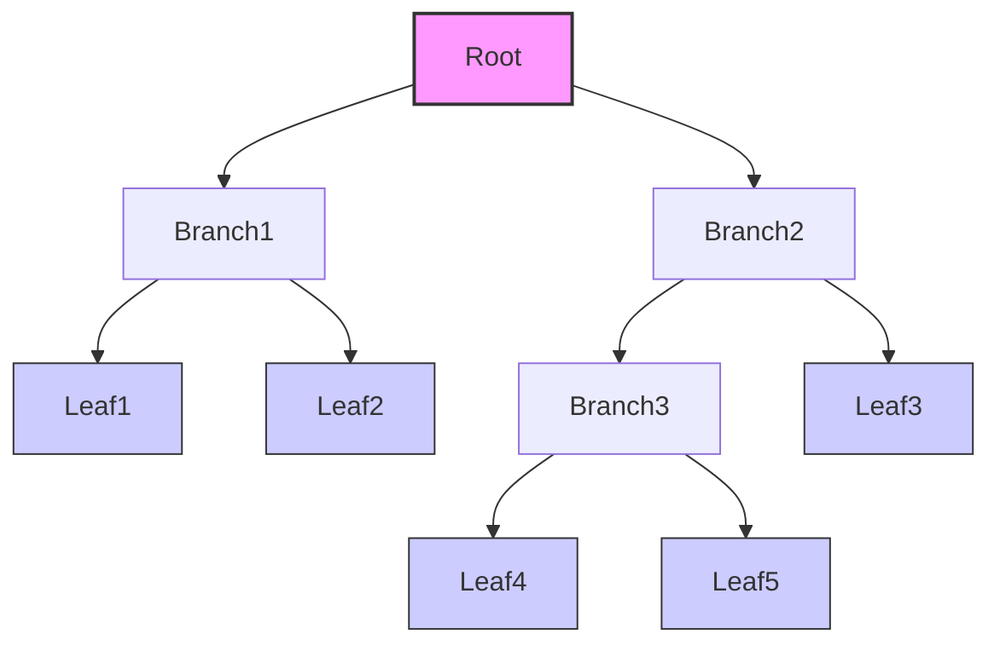
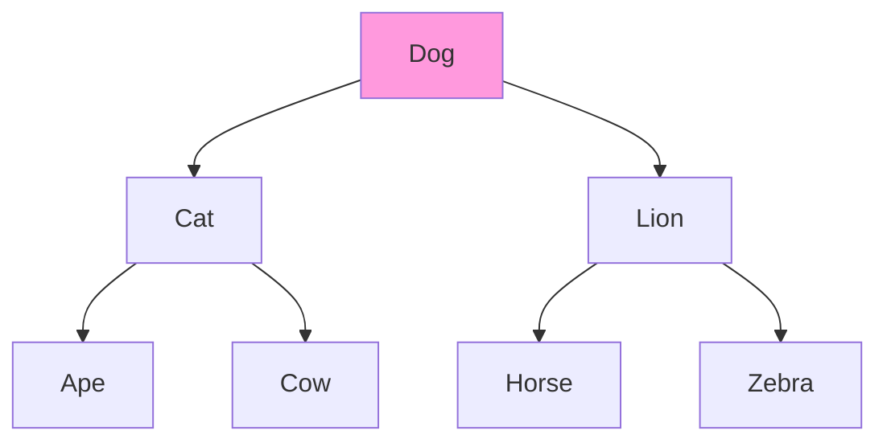
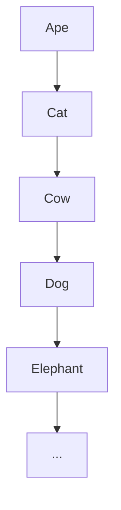
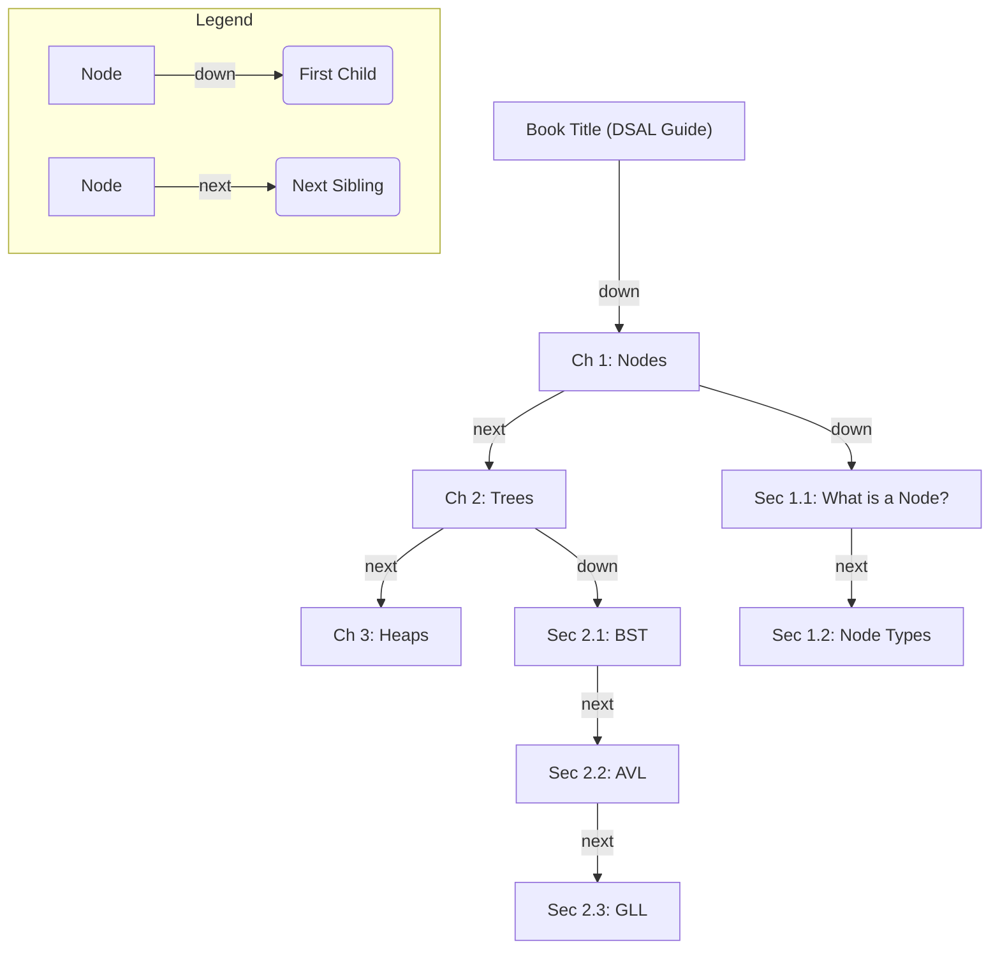
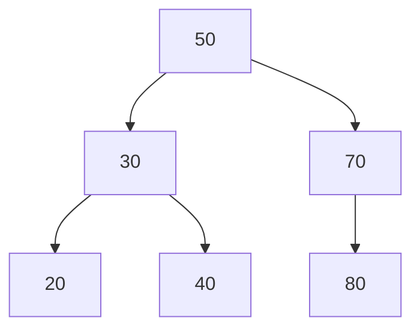
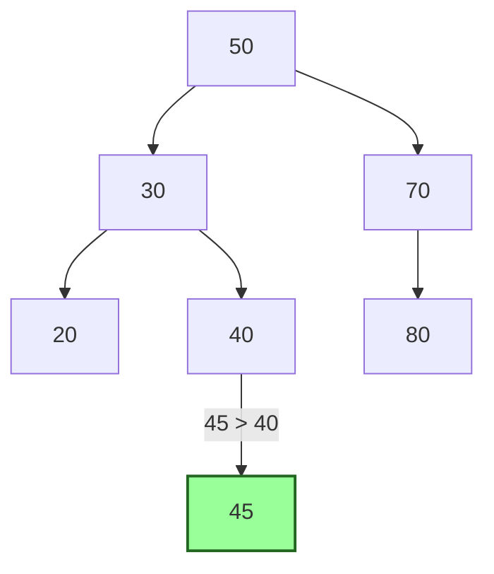
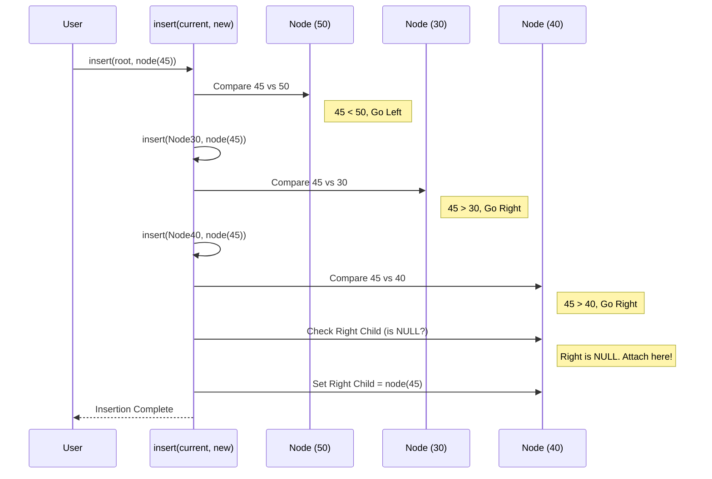

# Chapter 2: Tree Structures (BST, AVL, OBST, GLL)

Hey there! Welcome back. In [Chapter 1: Node Representation](01_node_representation_.md), we learned about the fundamental building block, the **node**, which holds data and pointers (links) to other nodes. Now, let's see how we can connect these nodes to create powerful hierarchical structures called **Trees**.

## What's the Problem? Organizing Information Hierarchically

Imagine you're creating a digital dictionary or organizing a book online. You have lots of words and their meanings, or a book with chapters, sections, and subsections. How do you store this information so you can:

1.  **Find things quickly?** (Look up a word's meaning, find Section 2.3).
2.  **Add new information easily?** (Add a new word, insert a new chapter).
3.  **Keep things organized logically?** (Words in alphabetical order, book structure maintained).

Trying to store everything in a simple list might work for small amounts of data, but it becomes very slow to search as the list grows. We need a better way to organize hierarchical or ordered data. That's where **Trees** come in!

Think of a real tree: it has a main trunk (the root), branches splitting off, and leaves at the very end. Data Trees work similarly!



In computer science, a Tree is a collection of nodes connected in a parent-child relationship.

*   **Root:** The topmost node (like the trunk).
*   **Parent:** A node that has nodes below it.
*   **Child:** A node directly connected below another node.
*   **Leaf:** A node with no children (like the leaves on a real tree).
*   **Siblings:** Nodes with the same parent.

This structure is incredibly useful! Let's explore a few important types of trees used in the DSAL project.

## 1. Binary Search Tree (BST): Keeping Things Ordered

Imagine our dictionary again. We want to find words quickly. A Binary Search Tree (BST) is perfect for this.

**The Big Idea:** In a BST, every node follows a simple rule:
*   All nodes in the **left** subtree have data **smaller** than the parent node's data.
*   All nodes in the **right** subtree have data **larger** than the parent node's data.
*   It's "Binary" because each node can have at most *two* children (a left child and a right child).

Remember the BST node from Chapter 1?

```c++
// From DSAL code: 4_BST.cpp / 5_Dictionary.cpp
struct node
{
    // Data (e.g., an integer or a keyword string)
    int data;       // Or: char k[20]; for keyword
    // Pointers to children
    node *L;        // Pointer to the left child node (Smaller values)
    node *R;        // Pointer to the right child node (Larger values)
};
```

**How it Works (Searching):** If you're looking for the word "Elephant", you start at the root:
1.  Compare "Elephant" to the word at the root node.
2.  If it's a match, you found it!
3.  If "Elephant" comes *before* the root word alphabetically, you only need to search the *left* subtree.
4.  If "Elephant" comes *after* the root word, you only need to search the *right* subtree.
5.  You repeat this process, effectively cutting the search area in half each time!


*Example: Searching for "Horse"*
1. Start at "Dog". "Horse" > "Dog", go RIGHT.
2. Now at "Lion". "Horse" < "Lion", go LEFT.
3. Now at "Horse". Found it!

This structure is used in `4_BST.cpp` for numbers and `5_Dictionary.cpp` for keywords.

## 2. AVL Tree: Keeping Things Balanced

BSTs are great, but they have a potential problem. What if you add words in alphabetical order ("Ape", "Cat", "Cow", "Dog", ...)? The tree would look like this:



This isn't much better than a list! Searching becomes slow again. We want our tree to be "bushy" rather than "stringy".

**The Big Idea:** An AVL Tree is a special type of BST that automatically *balances* itself whenever you add or remove a node. It makes sure the height difference between the left and right subtrees of any node is at most 1.

**How it Works:** If adding or removing a node makes the tree unbalanced, the AVL tree performs clever operations called **rotations** to rearrange the nodes and restore balance. This keeps the tree relatively bushy, guaranteeing fast search, insertion, and deletion times (logarithmic complexity, which is very efficient!).

```mermaid
graph TD
    subgraph Unbalanced BST (after inserting C)
        A1[A] --> B1[B]
        B1 --> C1[C]
    end
    subgraph Balanced AVL Tree (after rotation)
        B2[B] --> A2[A]
        B2 --> C2[C]
    end
```

The DSAL project uses AVL trees in `9_HeightBalancedTree_AVL.cpp` to maintain a balanced dictionary, ensuring consistently good performance even with many additions or deletions. You don't need to worry about the complex rotation logic right now, just know that AVL trees automatically keep themselves efficient.

## 3. Generalized Linked List (GLL): Representing Nested Structures

What about our book example with chapters, sections, and subsections? This isn't just about ordering; it's about *nesting* or hierarchy. A standard BST or AVL tree doesn't quite capture this structure.

**The Big Idea:** A Generalized Linked List (GLL) uses nodes with special pointers to represent these nested structures. In DSAL, we use it for the book structure.

Remember the book node from Chapter 1 (`3_Book.cpp`):

```c++
// From DSAL code: 3_Book.cpp
struct node
{
    char name[20]; // Data: Name (e.g., "Chapter 1", "Intro")
    node *next;    // Link to the NEXT item at the SAME level
                   // (e.g., Chapter 1 -> Chapter 2)
    node *down;    // Link to the FIRST item one level DOWN
                   // (e.g., Chapter 1 -> Section 1.1)
    int flag;      // Helper: 1 if this node has children below it, 0 otherwise
};
```

**How it Works:**
*   The `head` node represents the book title.
*   The `down` pointer from the book node points to the *first chapter*.
*   The `next` pointer connects chapters at the same level (Chapter 1 -> Chapter 2 -> Chapter 3).
*   If a chapter has sections, its `flag` is 1, and its `down` pointer points to the *first section*.
*   Sections are linked using their `next` pointers (Section 1.1 -> Section 1.2).
*   This continues for subsections using their `down` and `next` pointers.



This GLL structure perfectly models the book's table of contents, allowing us to navigate through chapters and sections easily. It's implemented in `3_Book.cpp` and `3_Book (1).cpp`.

## 4. Optimal Binary Search Tree (OBST): Optimizing for Frequent Searches

Imagine you run a popular website, and you know that users search for certain keywords *much* more often than others (e.g., "Login" is searched way more than "Privacy Policy Update 2017").

**The Big Idea:** An Optimal Binary Search Tree (OBST) is a BST that is specifically constructed to minimize the *average search time*, given that you know the probabilities or frequencies of searching for each key (and even the probabilities of searching for keys that *don't* exist between the actual keys).

**How it Works:** It arranges the nodes so that the most frequently searched items are closer to the root of the tree. This might mean the tree doesn't strictly follow the height-balance rules of an AVL tree, but it results in the fastest overall search performance *for that specific pattern of searches*.

Constructing an OBST is more complex than a regular BST. It involves calculating costs and weights based on probabilities. The DSAL code in `8_OBST.cpp` demonstrates how to build one. We'll dive deeper into exactly *how* to build an OBST in [Chapter 4: Optimal Binary Search Tree (OBST) Construction](04_optimal_binary_search_tree__obst__construction_.md). For now, just know it's a specialized BST for optimizing known search patterns.

## Using Trees: A BST Insertion Example

Let's see how we might add a number (say, 45) to a simple BST using the logic from `4_BST.cpp`.

Assume our tree looks like this initially:



**Goal:** Insert 45.

**Steps (Conceptual):**
1.  Start at the root (50).
2.  Is 45 smaller or larger than 50? Smaller. Go LEFT to 30.
3.  Is 45 smaller or larger than 30? Larger. Go RIGHT to 40.
4.  Is 45 smaller or larger than 40? Larger. Try to go RIGHT.
5.  There's no node to the right of 40 (it's `NULL`). This is where 45 belongs!
6.  Create a new node with 45 and make it the right child of 40.

**Simplified Code Idea (`insert`):**

```c++
// Simplified idea of BST insert (from 4_BST.cpp logic)
void insert(node *current_root, node *new_node) {
    // Compare new data with current node's data
    if (new_node->data > current_root->data) {
        // Go Right
        if (current_root->R == NULL) { // Found the spot!
            current_root->R = new_node;
        } else {
            insert(current_root->R, new_node); // Keep searching right
        }
    } else {
        // Go Left (assuming no duplicates for simplicity)
        if (current_root->L == NULL) { // Found the spot!
            current_root->L = new_node;
        } else {
            insert(current_root->L, new_node); // Keep searching left
        }
    }
}

// How you might start the insertion:
// node *temp = new node;
// temp->data = 45;
// temp->L = NULL; temp->R = NULL;
// if (root == NULL) root = temp; else insert(root, temp);
```
This code recursively travels down the tree until it finds an empty spot (`NULL`) where the new node fits according to the BST rules, and then links it.

**Resulting Tree:**



## Internal Implementation: How `insert` Works (BST)

Let's visualize the BST insertion process step-by-step.

**Walkthrough:**
1.  **User Call:** The user wants to insert `45`. They call the `insert` function, providing the `root` of the tree and the `new_node` containing 45.
2.  **Compare at Root:** The function compares `45` with the root's data (`50`). `45 < 50`, so it needs to go into the left subtree.
3.  **Go Left:** The function calls itself recursively (or iterates) with the left child (`30`) as the new current node.
4.  **Compare at Node 30:** Compare `45` with `30`. `45 > 30`, so it needs to go into the right subtree of `30`.
5.  **Go Right:** The function calls itself recursively (or iterates) with the right child (`40`) as the new current node.
6.  **Compare at Node 40:** Compare `45` with `40`. `45 > 40`, so it needs to go into the right subtree of `40`.
7.  **Find NULL:** The function checks the right child of `40`. It's `NULL`. This is the insertion point!
8.  **Attach Node:** The function sets the `R` (right pointer) of node `40` to point to the `new_node` (containing 45).
9.  **Done:** The insertion is complete.

**Sequence Diagram (Simplified):**



**Code Reference (`4_BST.cpp`):**
The actual code uses recursion or iteration to implement this logic.

```c++
// Simplified recursive insert from 4_BST.cpp
void bst::insert(node *current_root, node* temp) // temp is the new node
{
    if(temp->data > current_root->data) // Should go right?
    {
        if(current_root->R == NULL) // Is the right spot empty?
        {
            current_root->R = temp; // Yes, attach node here.
        }
        else
            insert(current_root->R, temp); // No, keep searching down the right subtree.
    }
    else // Should go left (or handle equal case)
    {
        if(current_root->L == NULL) // Is the left spot empty?
        {
            current_root->L = temp; // Yes, attach node here.
        }
        else
            insert(current_root->L, temp); // No, keep searching down the left subtree.
    }
}
```
This concise recursive function elegantly handles the traversal down the tree to find the correct insertion point.

## Conclusion

Wow! We've covered a lot about trees. You've learned:

*   Trees organize data **hierarchically**, like a family tree or org chart.
*   **Binary Search Trees (BSTs)** keep data ordered for fast searching (`5_Dictionary.cpp`, `4_BST.cpp`).
*   **AVL Trees** are self-balancing BSTs that guarantee consistently fast performance (`9_HeightBalancedTree_AVL.cpp`).
*   **Generalized Linked Lists (GLLs)** can represent nested structures like a book's table of contents using `next` and `down` pointers (`3_Book.cpp`).
*   **Optimal BSTs (OBSTs)** minimize average search time when search frequencies are known (`8_OBST.cpp`), with construction details coming later.

Trees are fundamental structures used everywhere in computing, from databases and file systems to graphics and AI. Understanding how they store and organize information is a huge step!

Ready to look at another specialized tree-like structure? Next, we'll explore Heaps, which are great for quickly finding the smallest or largest item. Let's move on to [Chapter 3: Heap Structures (Min/Max)](03_heap_structures__min_max__.md).

---

Generated by [AI Codebase Knowledge Builder](https://github.com/The-Pocket/Tutorial-Codebase-Knowledge)