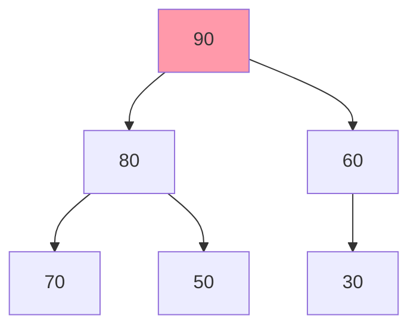
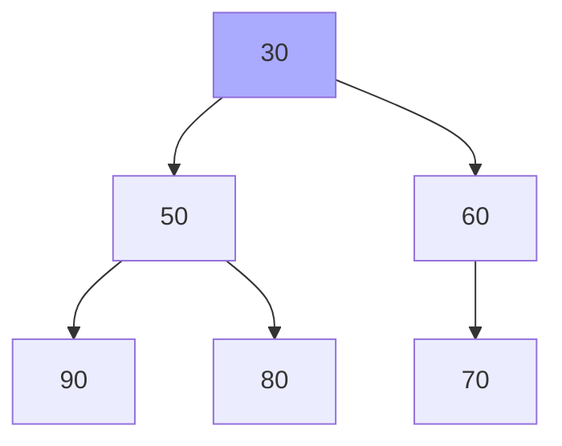
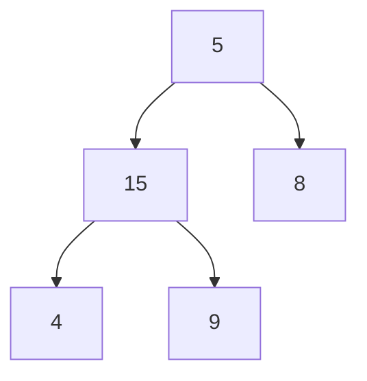
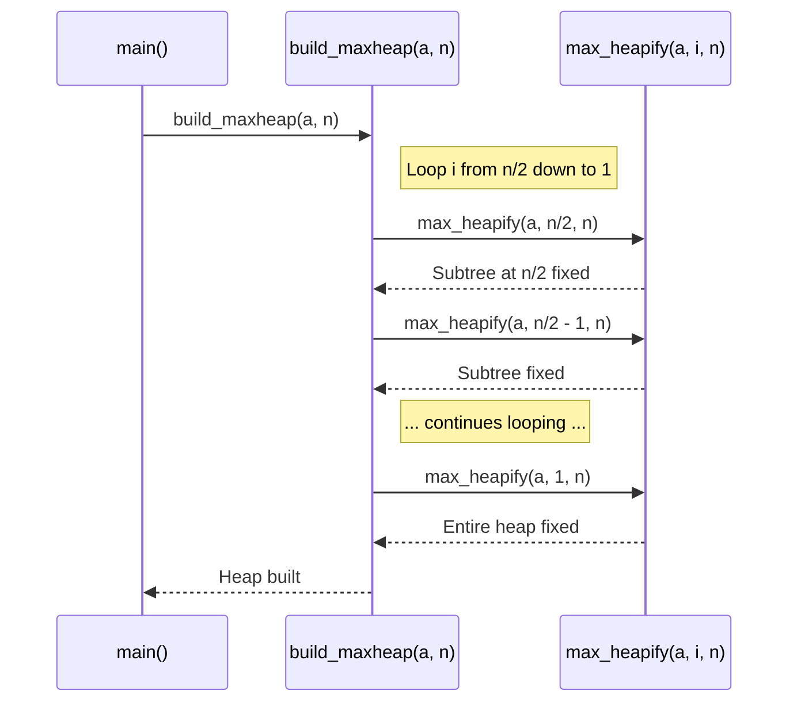

# Chapter 3: Heap Structures (Min/Max)

Welcome back! In [Chapter 2: Tree Structures (BST, AVL, OBST, GLL)](02_tree_structures__bst__avl__obst__gll__.md), we explored various ways trees help organize information hierarchically and for efficient searching. Now, let's look at a special kind of tree structure called a **Heap**, which is fantastic for situations where you constantly need to find the item with the highest (or lowest) priority.

## What's the Problem? Finding the Top (or Bottom) Quickly!

Imagine you're managing a list of student marks for a competition. You frequently need to know:
*   Who has the **highest** score right now?
*   Who has the **lowest** score right now?

Or think about a hospital emergency room: doctors always need to see the **most urgent** patient first. How can we organize data so that finding the maximum (highest score, most urgent patient) or minimum (lowest score) element is super fast?

A simple list requires checking every single item to find the max or min. A sorted list makes finding them easy (they're at the ends), but adding new items and keeping it sorted can be slow. We need something better!

## Enter the Heap: A Priority-Focused Structure

A **Heap** is a specialized tree-based data structure that satisfies the **Heap Property**. It's like a priority waiting list where the most important item (highest or lowest value) is always easy to find right at the front (the root of the tree).

There are two main types of heaps:

1.  **Max Heap:** In a Max Heap, the value of each **parent** node is always **greater than or equal to** the values of its children. This means the largest element in the heap is always at the **root**.
    *   *Analogy:* Think of an organization chart where the CEO (root) has the highest rank.

2.  **Min Heap:** In a Min Heap, the value of each **parent** node is always **less than or equal to** the values of its children. This means the smallest element in the heap is always at the **root**.
    *   *Analogy:* Think of a tournament bracket where the winner (root) advances from beating lower-ranked players (children).

**Important Note:** While we often *visualize* heaps as trees, they are typically implemented very efficiently using an **array** in memory! The parent-child relationships are calculated using array indices.

## Visualizing Heaps

Let's take some student marks: `[70, 90, 30, 80, 50, 60]`.

How would these look as a Max Heap and a Min Heap? Heaps are usually *complete binary trees*, meaning all levels are filled except possibly the last one, which is filled from left to right.

**Max Heap (Parent >= Children):** The largest value (90) is at the root.


*Notice: 90 >= 80, 90 >= 60, 80 >= 70, 80 >= 50, 60 >= 30.*

**Min Heap (Parent <= Children):** The smallest value (30) is at the root.


*Notice: 30 <= 50, 30 <= 60, 50 <= 90, 50 <= 80, 60 <= 70.*

## How it Works: The DSAL Example (Student Marks)

The `10_Heap.cpp` code in DSAL demonstrates exactly this: taking a list of student marks and arranging them into either a Min Heap or a Max Heap.

**Goal:** Take an array of marks and rearrange it so it satisfies the Min Heap or Max Heap property.

**Example:**

*   **Input:** Let's say the user enters 6 marks: `[70, 90, 30, 80, 50, 60]` (stored in an array `a`).
*   **User Chooses:** Max Heap.
*   **Output:** The code rearranges the array `a` to represent a Max Heap. The printed output might look like this (the exact order after the first element can vary slightly depending on the algorithm, but the heap property holds): `[90, 80, 60, 70, 50, 30]`
*   **User Chooses:** Min Heap.
*   **Output:** The code rearranges the array `a` to represent a Min Heap. The printed output might look like this: `[30, 50, 60, 90, 80, 70]`

Now, finding the max score (in the Max Heap) or min score (in the Min Heap) is trivial – it's just the first element of the array (`a[1]` in the DSAL code, as it uses 1-based indexing for heaps)!

## Code Example: Building a Heap in DSAL

Let's look at the `main` part of `10_Heap.cpp` to see how it orchestrates this.

**1. Getting Input:**

```c++
// Simplified from 10_Heap.cpp main()
#include <iostream>
using namespace std;
// ... (heapify functions declared above) ...

int main() {
    int n, i, ch;
    cout << "Enter no of marks of array\n";
    cin >> n;
    int a[20]; // Array to hold marks (using 1-based index)
    for (i = 1; i <= n; i++) {
        cout << "Enter marks" << (i) << endl;
        cin >> a[i];
    }
    // Now 'a' contains the marks entered by the user.
    // Example: if n=6, 'a' might be [?, 70, 90, 30, 80, 50, 60]
    // (a[0] is unused)
```
*   This part just sets up an array `a` and asks the user to fill it with `n` marks, starting from index 1.

**2. Choosing Heap Type and Building:**

```c++
// Simplified from 10_Heap.cpp main() loop
    cout << "\n***Enter the choice***\n1.MIN Heap\n2.MAX Heap\n";
    cin >> ch;
    switch (ch) {
        case 1:
            build_minheap(a, n); // Call function to build Min Heap
            cout << "Min Heap\n";
            // ... (printing code below) ...
            break;
        case 2:
            build_maxheap(a, n); // Call function to build Max Heap
            cout << "Max Heap\n";
            // ... (printing code below) ...
            break;
    }
```
*   The user chooses 1 for Min Heap or 2 for Max Heap.
*   Crucially, it calls `build_minheap(a, n)` or `build_maxheap(a, n)`. These functions do the magic of rearranging the array `a` to satisfy the chosen heap property.

**3. Printing the Result:**

```c++
// Simplified from 10_Heap.cpp main() printing part
    // (Inside the switch cases)
    for (i = 1; i <= n; i++) {
        cout << a[i] << endl;
    }
```
*   After building the heap, this loop simply prints the elements of the (now rearranged) array `a`.

The core work happens inside `build_minheap` / `build_maxheap` and their helper function `min_heapify` / `max_heapify`.

## Internal Implementation: How `heapify` Fixes the Heap

The magic behind building a heap lies in a function often called `heapify` (or `siftDown`, `bubbleDown`). Its job is to take a subtree that might be violating the heap property (because its root is wrong) and fix it by letting the root "trickle down" to its correct position.

**The `build_heap` Strategy:**
The `build_maxheap` (and `build_minheap`) functions work cleverly. They start from the *last non-leaf node* in the tree (index `n/2` in the array) and work their way *backwards* up to the root (index 1). For each node they encounter, they call `max_heapify` (or `min_heapify`) to ensure the subtree rooted at that node satisfies the heap property. By the time they reach the root, the entire array represents a valid heap!

**`heapify` Walkthrough (Conceptual - Max Heap):**
Imagine we call `max_heapify` on a node `i` whose subtree looks like this, violating the Max Heap property (5 < 15):



1.  **Compare:** Look at node `i` (value 5), its left child (15), and its right child (8).
2.  **Find Largest:** Find the largest among these three. It's 15 (the left child).
3.  **Swap:** Since the largest is *not* the current node `i`, swap node `i` (5) with the largest child (15).

    ```mermaid
    graph TD
        NodeI[15] --> Left[5]
        NodeI --> Right[8]
        Left --> LL[4]
        Left --> LR[9]

        style Left fill:#f9f
        style NodeI fill:#f9f
    ```

4.  **Recurse/Repeat:** Now, the node that moved *down* (the original 5) might violate the heap property further down. So, we repeat the process starting from the new position of the value 5.
5.  **Compare:** Look at node (value 5), its new left child (4), and right child (9).
6.  **Find Largest:** The largest is 9 (the right child).
7.  **Swap:** Swap 5 and 9.

    ```mermaid
    graph TD
        NodeI[15] --> Left[9]
        NodeI --> Right[8]
        Left --> LL[4]
        Left --> LR[5]

        style Left fill:#lightgreen
        style LR fill:#lightgreen
    ```
8.  **Recurse/Repeat:** The value 5 is now at a leaf node. It has no children, so the process stops. The subtree is now fixed!

**Sequence Diagram (Simplified `build_maxheap`):**



**Code Dive (`max_heapify`):**

Let's peek inside `max_heapify` from `10_Heap.cpp`. Remember, it uses an array `a` where index `i` is the parent, `2*i` is the left child, and `2*i+1` is the right child.

```c++
// Simplified version of max_heapify from 10_Heap.cpp
void max_heapify(int *a, int i, int n) {
    int largest = i; // Assume current node 'i' is largest initially
    int left = 2 * i;    // Index of left child
    int right = 2 * i + 1;   // Index of right child

    // Find the actual largest among node 'i' and its children
    // Check if left child exists and is larger than current largest
    if (left <= n && a[left] > a[largest]) {
        largest = left;
    }
    // Check if right child exists and is larger than current largest
    if (right <= n && a[right] > a[largest]) {
        largest = right;
    }

    // If largest is NOT the current node 'i', then swap and recurse
    if (largest != i) {
        // Swap a[i] and a[largest]
        int temp = a[i];
        a[i] = a[largest];
        a[largest] = temp;

        // Recursively call heapify on the affected subtree below
        // (The DSAL code uses a while loop instead of recursion,
        // but the idea is the same: fix the subtree where the
        // original a[i] landed)
        // Recursive equivalent: max_heapify(a, largest, n);
        
        // --- DSAL's iterative approach (simplified logic) ---
        // The DSAL code uses a while loop and updates 'i' and 'j'
        // to continue the process downwards iteratively instead
        // of making a recursive call. It keeps checking children
        // (j = 2*j) and swapping (a[j/2] = a[j]) until the element
        // finds its correct place ('break' condition).
    }
}
```

*   The function first finds out which node (the parent `i`, the left child `2*i`, or the right child `2*i+1`) holds the largest value.
*   If the parent `i` doesn't hold the largest value, it swaps the parent with the largest child.
*   Crucially, after the swap, the element that moved *down* might still be smaller than *its* new children. So, the process needs to continue downwards (either via recursion as shown conceptually, or iteration as in the actual DSAL code) from the position where the swapped element landed (`largest`). This ensures the element "trickles down" to its correct spot.

The `min_heapify` function works exactly the same way, but it looks for the *smallest* element among the parent and children and swaps if the parent isn't the smallest.

## Conclusion

You've now learned about **Heap Structures**!

*   They are tree-like structures (usually implemented with arrays) focused on keeping the **highest (Max Heap)** or **lowest (Min Heap)** value easily accessible at the **root**.
*   They maintain the **Heap Property**: Parents are always >= children (Max Heap) or <= children (Min Heap).
*   The core operation to maintain this property is `heapify`, which allows elements to "trickle down" to their correct position.
*   Heaps are incredibly useful for implementing **Priority Queues** (like our emergency room or highest-score examples) and are a key part of efficient sorting algorithms like HeapSort.

In the next chapter, we'll revisit Binary Search Trees and explore a specialized technique for building them when we know how often each item will be searched. Get ready for [Chapter 4: Optimal Binary Search Tree (OBST) Construction](04_optimal_binary_search_tree__obst__construction_.md).

---

Generated by [AI Codebase Knowledge Builder](https://github.com/The-Pocket/Tutorial-Codebase-Knowledge)