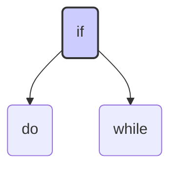
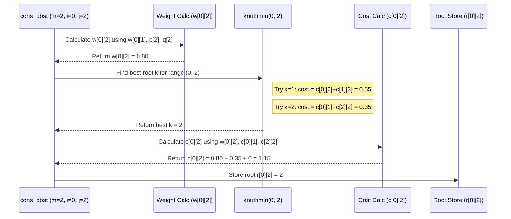

# Chapter 4: Optimal Binary Search Tree (OBST) Construction

Hello again! In [Chapter 3: Heap Structures (Min/Max)](03_heap_structures__min_max__.md), we learned how Heaps help us quickly find the minimum or maximum element. Now, let's return to Binary Search Trees ([Chapter 2: Tree Structures (BST, AVL, OBST, GLL)](02_tree_structures__bst__avl__obst__gll__.md)) and explore a fascinating way to build them for the *best possible average performance* when we know how often different items are searched.

## The Problem: Faster Lookups for Common Words

Imagine you're building the search function for a programming language documentation website. You have keywords like `if`, `for`, `while`, `class`, `int`, etc. You know from experience or data logging that some keywords are searched *far* more frequently than others. For example, `if` and `for` are probably looked up much more often than `volatile` or `register`.

A standard Binary Search Tree (BST) just arranges keys based on their alphabetical or numerical order. An AVL tree keeps the tree balanced for generally good performance. But neither specifically uses the *frequency* of searches to its advantage.

If we put a very common word like `if` deep down in the tree, many searches will take a long time. Wouldn't it be great if we could build a BST where the most frequently searched keywords are placed closer to the root, even if the tree isn't perfectly balanced height-wise? This would minimize the *average* search time for users.

This is exactly what an **Optimal Binary Search Tree (OBST)** aims to achieve.

## How OBST Works: Using Probabilities

The core idea of OBST is to use probabilities (or frequencies) to determine the best structure. We need two types of probabilities:

1.  **Success Probabilities (`p[i]`):** The probability that someone searches for a specific keyword `i` that *is* in our set. (e.g., the probability of searching for `if`).
2.  **Failure Probabilities (`q[i]`):** The probability that someone searches for a keyword that *falls between* two existing keywords (or before the first/after the last). These searches will fail to find an exact match. (e.g., the probability of searching for something alphabetically between `for` and `if`, or searching for something after `while`).

**Example:**
Let's say we have 3 keywords (keys): `do`, `if`, `while`. Let's assign some (made-up) probabilities:
*   Keys: `a = [?, 'do', 'if', 'while']` (using 1-based index like in the code)
*   Success Probabilities `p`: `[?, 0.15, 0.10, 0.05]` (Prob. of searching `do` is 0.15, `if` is 0.10, `while` is 0.05)
*   Failure Probabilities `q`: `[0.05, 0.10, 0.05, 0.05]` (Prob. of searching < `do` is 0.05, between `do` and `if` is 0.10, between `if` and `while` is 0.05, > `while` is 0.05)
    *   Note: The sum of all `p` and `q` probabilities should ideally be 1 (or 100%). (0.15+0.10+0.05 + 0.05+0.10+0.05+0.05 = 0.55... let's adjust for example: `p=[0.2, 0.3, 0.1]`, `q=[0.05, 0.1, 0.15, 0.1]` Sum = 1.0)
    *   Let's use these adjusted values: `p=[?, 0.2, 0.3, 0.1]`, `q=[0.05, 0.1, 0.15, 0.1]`

**The Goal:** Arrange `do`, `if`, `while` into a BST structure such that the *average search cost* is minimized. The cost of searching for a key is related to how deep it is in the tree (root is level 1, its children level 2, etc.). The average cost considers the cost of finding each key *times* its probability, plus the cost of hitting each "failure gap" *times* its probability.

## Dynamic Programming to the Rescue!

Finding the absolute best tree isn't simple. Trying all possible tree structures would take way too long for many keywords. OBST construction uses a powerful technique called **Dynamic Programming**.

**The Big Idea (Dynamic Programming):**
1.  Solve the problem for the *smallest possible sub-problems* first.
2.  Store these solutions.
3.  Use the solutions to small sub-problems to build solutions for slightly larger sub-problems.
4.  Repeat until you've solved the original, full problem.

**For OBST, this means:**
1.  Find the cost of the best "tree" containing *no* keys (just a failure gap `q[i]`). Cost = 0, Weight = `q[i]`.
2.  Find the cost of the best tree containing just *one* key (`a[i]`). This tree must have `a[i]` as the root. Cost = Weight = `q[i-1] + p[i] + q[i]`.
3.  Find the cost of the best tree containing *two* keys (`a[i]`, `a[i+1]`). Try `a[i]` as root, then try `a[i+1]` as root. Choose the one with the lower average cost. Store the best cost and which key was chosen as the root.
4.  Continue finding the best cost and root for subtrees of 3 keys, 4 keys, ..., up to all `n` keys. Each step uses the results calculated for smaller subtrees.

## The `8_OBST.cpp` Approach

The DSAL code implements this dynamic programming strategy using several arrays (matrices):

*   `a[10]`: Stores the keys (keywords).
*   `p[10]`: Stores the success probabilities `p[i]` for key `a[i]`.
*   `q[10]`: Stores the failure probabilities `q[i]` for the gap *before* key `a[i+1]` (and `q[0]` is before `a[1]`, `q[n]` is after `a[n]`).
*   `w[10][10]`: Stores the **weight** of subtrees. `w[i][j]` is the sum of all probabilities (`p`'s and `q`'s) for the keys `a[i+1]` to `a[j]` and the failure gaps within and around them (`q[i]` to `q[j]`). `w[i][j] = p[i+1] + ... + p[j] + q[i] + ... + q[j]`. It represents the total probability of landing somewhere within this range.
*   `c[10][10]`: Stores the minimum **cost** (minimum expected search cost) for an optimal BST containing keys `a[i+1]` to `a[j]`.
*   `r[10][10]`: Stores the index `k` of the **root** (`a[k]`) of the optimal BST for the keys `a[i+1]` to `a[j]`.

### Step 1: Getting the Input (`accept`)

First, the program needs the keywords and their probabilities.

```c++
// Simplified from 8_OBST.cpp obst::accept()
void obst::accept() {
    int i;
    cout << "how many elements are there in the tree?\n";
    cin >> n; // e.g., n = 3

    cout << "enter " << n << " elements (keys) \n";
    for (i = 1; i <= n; i++)
        cin >> a[i]; // e.g., a = [?, 'do', 'if', 'while']

    cout << "enter " << n << " their success probabilities (p)\n";
    for (i = 1; i <= n; i++)
        cin >> p[i]; // e.g., p = [?, 0.2, 0.3, 0.1]

    cout << "enter " << n + 1 << " failure probabilities (q)\n";
    for (i = 0; i <= n; i++)
        cin >> q[i]; // e.g., q = [0.05, 0.1, 0.15, 0.1]
}
```
*   This function simply asks the user for the number of keys (`n`), the keys themselves (`a`), the success probabilities (`p`), and the failure probabilities (`q`).

### Step 2: Building the Optimal Tree (`cons_obst`)

This is the core dynamic programming part. It fills the `w`, `c`, and `r` tables.

**Initialization (Base Cases):**
The code first initializes the tables for subtrees of size 0 (only failure gaps) and size 1 (one key).

```c++
// Simplified from 8_OBST.cpp obst::cons_obst() - Initialization Part
void obst::cons_obst() {
    int i, m, j, k;
    // Initialize for subtrees of size 0 and 1
    for (i = 0; i < n; i++) {
        // Size 0: Just the failure gap q[i]
        w[i][i] = q[i];
        r[i][i] = c[i][i] = 0; // No keys, so root=0, cost=0

        // Size 1: Key a[i+1] between gaps q[i] and q[i+1]
        w[i][i + 1] = q[i] + q[i + 1] + p[i + 1]; // Total weight
        r[i][i + 1] = i + 1; // The only key, a[i+1], must be the root
        c[i][i + 1] = w[i][i + 1]; // Cost for a single-node tree is its weight
    }
    // Handle the last failure gap q[n]
    w[n][n] = q[n];
    r[n][n] = c[n][n] = 0;
    // ... (main loop below) ...
}
```
*   This sets up the known costs and weights for the smallest possible subproblems (trees with 0 or 1 key). For example, `c[0][1]` is the cost of the optimal tree just containing key `a[1]`.

**Main DP Loop:**
Now, it iteratively calculates the optimal cost and root for subtrees of increasing size (`m` = 2, 3, ..., `n`).

```c++
// Simplified from 8_OBST.cpp obst::cons_obst() - Main Loop Part
    // ... (Initialization above) ...
    // Calculate for subtrees of size m=2 up to n
    for (m = 2; m <= n; m++) {
        // Consider all subtrees of size m
        // 'i' is the starting index (0 to n-m)
        for (i = 0; i <= n - m; i++) {
            j = i + m; // 'j' is the ending index

            // 1. Calculate the total weight w[i][j]
            // w[i][j] includes keys a[i+1]...a[j] and gaps q[i]...q[j]
            w[i][j] = w[i][j - 1] + p[j] + q[j]; // Efficient way to calculate

            // 2. Find the best root 'k' (a[k]) for this subtree (i, j)
            // This root 'k' must be between i+1 and j
            k = knuthmin(i, j); // Find k that minimizes cost

            // 3. Calculate the minimum cost c[i][j] using the best root 'k'
            // Cost = Weight + Cost of Left Subtree + Cost of Right Subtree
            c[i][j] = w[i][j] + c[i][k - 1] + c[k][j];

            // 4. Store the best root 'k' in the root table
            r[i][j] = k;
        }
    }
    // ... (Printing the final tree below) ...
```
*   The outer loop (`m`) controls the *size* of the subtree we are currently solving (from 2 keys up to `n` keys).
*   The inner loop (`i`) controls the *starting point* of the subtree. `j` is calculated as the end point (`i + m`).
*   `w[i][j]` is calculated easily based on the previously calculated weight `w[i][j-1]`.
*   `knuthmin(i, j)` is a helper function (explained next) that finds the best key `a[k]` (where `i < k <= j`) to serve as the root for the subtree containing keys `a[i+1]` to `a[j]`. "Best" means choosing the `k` that minimizes the total expected cost.
*   The core formula `c[i][j] = w[i][j] + c[i][k - 1] + c[k][j]` calculates the minimum cost. It means: The cost of the optimal tree for keys `i+1` to `j` (when rooted at `a[k]`) is its total weight `w[i][j]` (because every search in this subtree adds 1 level of depth, contributing `w[i][j]` to the total cost) PLUS the minimum cost of its optimal left subtree (`c[i][k-1]`, for keys `a[i+1]`..`a[k-1]`) PLUS the minimum cost of its optimal right subtree (`c[k][j]`, for keys `a[k+1]`..`a[j]`). Notice how it uses the already computed costs of smaller subproblems!
*   `r[i][j] = k` stores the index of the root that achieved this minimum cost.

### Step 3: Finding the Best Root (`knuthmin`)

How does `knuthmin(i, j)` find the best root `k`? It tries every possible key `a[k]` (where `i < k <= j`) as the potential root for the subtree covering keys `a[i+1]` to `a[j]`. For each potential root `k`, it calculates the cost: `c[i][k-1] + c[k][j]` (this is the cost contributed by the left and right subtrees). It chooses the `k` that gives the *minimum* value for this sum. (Knuth's optimization actually narrows down the range of `k` to check, making it faster, but the principle is to find the `k` that minimizes the sub-costs).

```c++
// Simplified from 8_OBST.cpp obst::knuthmin()
// Finds the root 'k' (between i+1 and j) that minimizes
// the cost of the combined left and right subtrees.
int obst::knuthmin(int i, int j) {
    int min_subtree_cost = 999; // Initialize with a large value
    int best_k = -1; // Stores the index of the best root found so far

    // Try each 'k' from i+1 to j as a potential root
    // (The actual code uses r[i][j-1] to r[i+1][j] based on Knuth's optimization,
    // but conceptually it's checking potential roots in this range)
    for (int k = i + 1; k <= j; k++) {
        // Calculate cost if 'k' is the root: Cost(left) + Cost(right)
        int current_cost = c[i][k - 1] + c[k][j];

        // If this 'k' gives a better (lower) cost, update min_cost and best_k
        if (min_subtree_cost > current_cost) {
            min_subtree_cost = current_cost;
            best_k = k;
        }
    }
    return best_k; // Return the index 'k' of the best root found
}
```
*   This function iterates through possible roots `k`.
*   For each `k`, it looks up the pre-calculated optimal costs of the resulting left subtree (`c[i][k-1]`) and right subtree (`c[k][j]`).
*   It keeps track of the `k` that yields the minimum sum of these subtree costs.
*   It returns the best `k`.

### Step 4: Printing the Resulting Tree (`tree`)

After `cons_obst` fills the `c` and `r` tables, the entry `r[0][n]` holds the index of the root of the *overall* optimal tree. The `tree` function uses the `r` table recursively to print the structure.

```c++
// Simplified from 8_OBST.cpp obst::cons_obst() - Printing Part
    // ... (Main DP loop above) ...

    // The root of the entire optimal tree is a[r[0][n]]
    cout << "root node is " << a[r[0][n]];

    // Recursively print the left subtree
    cout << "\nleft child of " << a[r[0][n]] << " is ";
    tree(0, r[0][n] - 1); // Pass the range for the left subtree

    // Recursively print the right subtree
    cout << "\nright child of " << a[r[0][n]] << " is ";
    tree(r[0][n], n); // Pass the range for the right subtree
}

// Simplified from 8_OBST.cpp obst::tree()
// Prints the tree structure using the 'r' table recursively
void obst::tree(int i, int j) {
    // Base case: If r[i][j] is 0, it means this subtree is empty (a failure node)
    if (r[i][j] == 0) {
        cout << " NULL\n";
        return;
    }

    // Print the root of the current subtree (a[r[i][j]])
    cout << " :: " << a[r[i][j]];

    // Recursively print its left child/subtree
    cout << "\n left child of " << a[r[i][j]] << " is ";
    tree(i, r[i][j] - 1); // Range for left child is (i, root-1)

    // Recursively print its right child/subtree
    cout << "\n right child of " << a[r[i][j]] << " is ";
    tree(r[i][j], j); // Range for right child is (root, j)
}
```
*   The initial call starts with the overall root `a[r[0][n]]`.
*   The `tree(i, j)` function finds the root for the range `(i, j)` using `r[i][j]`.
*   If the root index is 0, it's an empty subtree (NULL).
*   Otherwise, it prints the root `a[r[i][j]]` and makes recursive calls to print the left subtree `tree(i, r[i][j]-1)` and the right subtree `tree(r[i][j], j)`.

### Example Output

For our adjusted input:
*   `a = [?, 'do', 'if', 'while']` (n=3)
*   `p = [?, 0.2, 0.3, 0.1]`
*   `q = [0.05, 0.1, 0.15, 0.1]`

The algorithm would fill the `w`, `c`, and `r` tables. The final result might determine that `if` (index 2) is the best root (`r[0][3] = 2`). The output could look something like:

```
root node is if
left child of if is :: do
 left child of do is  NULL
 right child of do is  NULL
right child of if is :: while
 left child of while is  NULL
 right child of while is  NULL
```

Resulting Tree Structure:


Notice that `if` (the most probable key, p=0.3) is at the root, leading to a lower average search cost compared to a tree rooted at `do`.

## Internal Implementation Walkthrough

Let's trace the calculation for `c[0][2]` (optimal tree for keys `a[1]`='do' and `a[2]`='if').
The loop runs with `m=2`, `i=0`, `j=2`.

1.  **Calculate Weight:** `w[0][2] = w[0][1] + p[2] + q[2]`.
    *   We need `w[0][1]`, which was calculated during initialization: `w[0][1] = q[0] + q[1] + p[1] = 0.05 + 0.1 + 0.2 = 0.35`.
    *   `w[0][2] = 0.35 + p[2] + q[2] = 0.35 + 0.3 + 0.15 = 0.80`.
2.  **Find Best Root `k` (`knuthmin(0, 2)`):**
    *   Possible roots `k` are 1 ('do') and 2 ('if').
    *   **Try `k=1` ('do'):** Cost = `c[0][k-1] + c[k][j]` = `c[0][0] + c[1][2]`.
        *   `c[0][0]` = 0 (from init).
        *   `c[1][2]` was calculated in init (range `i=1`, `j=i+1=2`): `c[1][2] = w[1][2] = q[1] + q[2] + p[2] = 0.1 + 0.15 + 0.3 = 0.55`.
        *   Cost if `k=1` is `0 + 0.55 = 0.55`.
    *   **Try `k=2` ('if'):** Cost = `c[0][k-1] + c[k][j]` = `c[0][1] + c[2][2]`.
        *   `c[0][1]` was calculated in init: `c[0][1] = w[0][1] = 0.35`.
        *   `c[2][2]` = 0 (from init).
        *   Cost if `k=2` is `0.35 + 0 = 0.35`.
    *   **Compare:** 0.35 (for k=2) < 0.55 (for k=1). So, the best root is `k=2` ('if'). `knuthmin(0, 2)` returns `2`.
3.  **Calculate Cost `c[0][2]`:**
    *   `c[0][2] = w[0][2] + c[0][k-1] + c[k][j]` (using best `k=2`)
    *   `c[0][2] = w[0][2] + c[0][1] + c[2][2]`
    *   `c[0][2] = 0.80 + 0.35 + 0 = 1.15`.
4.  **Store Root:** `r[0][2] = 2`.

This calculation shows that for the subtree with just 'do' and 'if', having 'if' as the root results in a lower expected cost (1.15). This process continues for all subtrees until `c[0][n]` and `r[0][n]` are found.

**Sequence Diagram (Simplified `cons_obst` loop for m=2, i=0):**



## Conclusion

Congratulations! You've learned about **Optimal Binary Search Trees (OBST)**:

*   They are BSTs designed to minimize the **average search cost** when you know the **probabilities** (or frequencies) of searching for keys (`p[i]`) and searching for values between keys (`q[i]`).
*   They use **dynamic programming** to build the solution bottom-up, finding the optimal structure for small subtrees first and using those results to solve larger ones.
*   The core idea involves calculating **weights** (`w`) and **costs** (`c`) for all possible subtrees and storing the **root** (`r`) that yields the minimum cost for each.
*   The key formula is `c[i][j] = w[i][j] + c[i][k-1] + c[k][j]`, where `k` is the best root for the subtree `(i, j)`.

OBSTs are a powerful example of how understanding usage patterns (like search frequencies) can help us design more efficient data structures.

Next, we shift gears from tree structures to another fundamental way of representing connections: Graphs. Let's dive into [Chapter 5: Graph Representation](05_graph_representation_.md).

---

Generated by [AI Codebase Knowledge Builder](https://github.com/The-Pocket/Tutorial-Codebase-Knowledge)