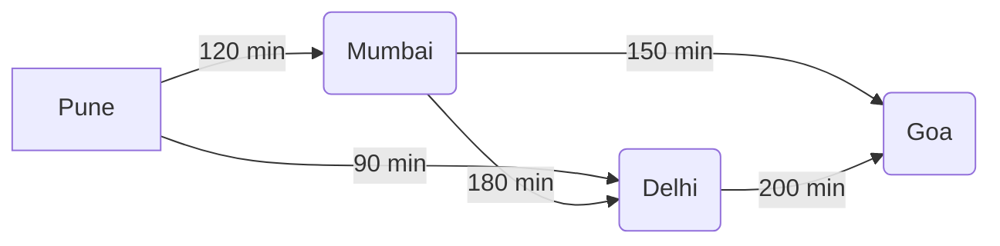
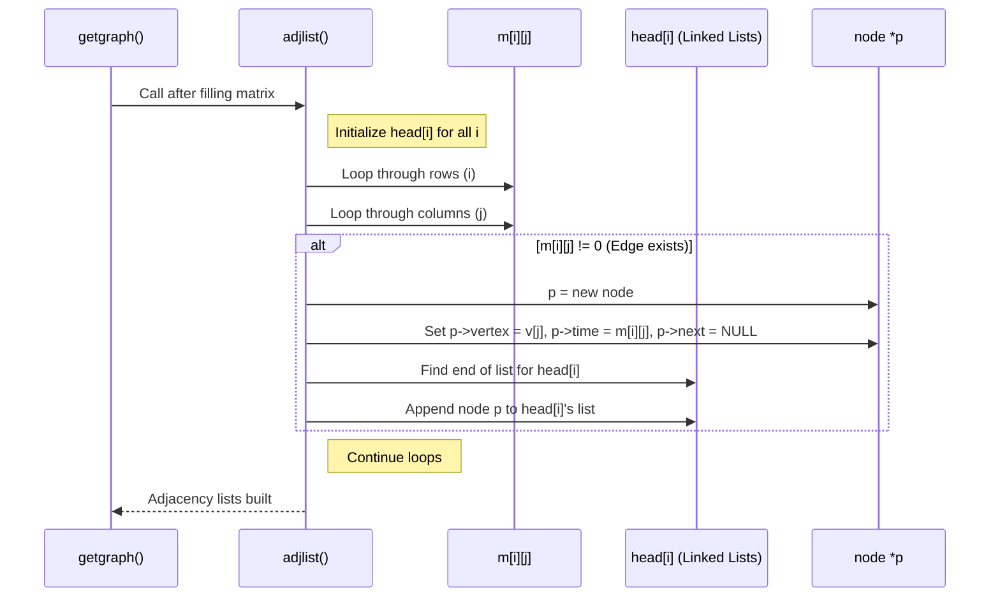

# Chapter 5: Graph Representation

Welcome back! In [Chapter 4: Optimal Binary Search Tree (OBST) Construction](04_optimal_binary_search_tree__obst__construction_.md), we learned how to build specialized trees that optimize search times based on known frequencies. Now, we're going to explore a different kind of structure that's perfect for representing networks and connections: **Graphs**.

## What's the Problem? Mapping Connections

Think about a real-world airline map. You have several cities, and there are flight paths connecting some of them. Each flight path might have a travel time or cost associated with it.

How can we represent this kind of information in a computer program? We need a way to store:
1.  The items themselves (the cities).
2.  The connections between them (the flight paths).
3.  Maybe some extra information about each connection (like the flight time).

Simple lists or trees don't quite capture this network structure where things can be connected in complex, non-hierarchical ways. This is where Graphs shine! Graphs are used everywhere: social networks (people connected as friends), road maps (cities connected by roads), computer networks (devices connected by cables/wifi), and much more.

## What is a Graph? Dots and Lines!

At its core, a graph is just a collection of:

1.  **Vertices (or Nodes):** These are the individual items or entities. Think of them as the dots on our map – the cities. In [Chapter 1: Node Representation](01_node_representation_.md), we learned about nodes, and here they represent the entities in our network.
2.  **Edges:** These are the connections *between* the vertices. Think of them as the lines connecting the dots – the flight paths. An edge connects two vertices.
3.  **(Optional) Weights:** Sometimes, edges have a value associated with them, called a weight. This could represent distance, cost, time, or capacity. For our flight map, the weight could be the travel time in minutes.



In this simple graph:
*   Vertices: Pune, Mumbai, Delhi, Goa
*   Edges: Pune-Mumbai, Pune-Delhi, Mumbai-Delhi, Mumbai-Goa, Delhi-Goa
*   Weights: 120 min, 90 min, 180 min, 150 min, 200 min (representing flight times)

## How Do We Store Graphs in Code? Two Common Ways

Okay, we understand the concept, but how do we translate this "dots and lines" idea into computer memory? The `DSAL` project (specifically in `6_Flight.cpp`) uses two popular methods:

### 1. Adjacency Matrix: The Grid Approach

Imagine a grid (like a spreadsheet or a checkerboard).
*   Label the rows with the names of your cities.
*   Label the columns with the names of your cities (in the same order).
*   The cell where row "City A" meets column "City B" will store the **weight** (e.g., flight time) of the direct connection from A to B.
*   If there's no direct flight from A to B, we often store a special value like 0 (as in `6_Flight.cpp`) or sometimes infinity.

**Example:** For the graph above:

|         | Pune | Mumbai | Delhi | Goa |
| :------ | :---: | :----: | :---: | :-: |
| **Pune**   | 0    | 120    | 90    | 0   |
| **Mumbai** | 0    | 0      | 180   | 150 |
| **Delhi**  | 0    | 0      | 0     | 200 |
| **Goa**    | 0    | 0      | 0     | 0   |

*(Note: `6_Flight.cpp` assumes no direct flight from Mumbai back to Pune unless specified, hence the 0s. If flights were two-way with the same time, the matrix would be symmetric.)*

**Pros:** Very quick to check if there's a direct edge between two specific vertices (just look up the cell `matrix[cityA_index][cityB_index]`).
**Cons:** Can use a lot of memory if you have many cities but few connections (most of the grid will be 0).

### 2. Adjacency List: The "Who Are Your Neighbors?" Approach

Imagine each city has its own little list. This list contains only the cities it has a direct flight *to*, along with the flight time for each.

**Example:** For the same graph:

*   **Pune:** -> [ (Mumbai, 120 min), (Delhi, 90 min) ]
*   **Mumbai:** -> [ (Delhi, 180 min), (Goa, 150 min) ]
*   **Delhi:** -> [ (Goa, 200 min) ]
*   **Goa:** -> [ ] (No outgoing flights in this example)

This is often implemented using linked lists, where each city has a pointer to the start of a list of its neighbors. Remember the `node` structure from [Chapter 1: Node Representation](01_node_representation_.md)? `6_Flight.cpp` uses a similar node for this:

```c++
// From DSAL code: 6_Flight.cpp (structure for Adjacency List)
struct node
{
    string vertex; // Data: Name of the connected city (e.g., "Mumbai")
    int time;      // Data: Time to reach this city (e.g., 120 mins)
    node *next;    // Link to the *next* city reachable from the
                   // same origin city in the list.
};
```

**Pros:** Uses memory proportional to the number of actual connections (edges), which is great for sparse graphs (few connections).
**Cons:** Checking for a specific edge between A and B might require searching through A's list.

## Using Graph Representations in `DSAL` (`6_Flight.cpp`)

The `6_Flight.cpp` code allows you to define a flight network and see both representations.

### Step 1: Defining the Graph (`getgraph`)

The program first asks you to define the graph: how many cities, their names, and the connections (paths and times) between them. This information is used to fill the **adjacency matrix** first.

```c++
// Simplified from 6_Flight.cpp adjmatlist::getgraph()
void adjmatlist::getgraph() {
    cout << "\n enter no. of cities(max. 20)";
    cin >> n; // How many cities? e.g., 4
    cout << "\n enter name of cities";
    for (i = 0; i < n; i++)
        cin >> v[i]; // Read names: e.g., Pune, Mumbai, Delhi, Goa

    // Now, ask about connections for the matrix
    for (i = 0; i < n; i++) { // From city v[i]...
        for (j = 0; j < n; j++) { // ...to city v[j]
            cout << "\n if path is present between city " << v[i]
                 << " and " << v[j] << " then press enter y otherwise n";
            cin >> ch;
            if (ch == 'y') {
                cout << "\n enter time required... in minutes";
                cin >> m[i][j]; // Store time in matrix[i][j]
            } else {
                m[i][j] = 0; // No direct path, store 0
            }
        }
    }
    // After filling the matrix, automatically build the adjacency list
    adjlist();
}
```
*   This function gets the city names and then loops through all possible pairs of cities (`v[i]` to `v[j]`).
*   It asks the user ('y'/'n') if a direct flight exists.
*   If 'y', it asks for the time and stores it in the adjacency matrix `m[i][j]`.
*   If 'n', it stores 0.
*   Finally, it calls `adjlist()` to build the other representation based on the matrix data.

### Step 2: Displaying the Representations (`displaym`, `displaya`)

Once the graph is defined, you can choose to display either the matrix or the list.

**Displaying the Matrix (`displaym`):**

```c++
// Simplified from 6_Flight.cpp adjmatlist::displaym()
void adjmatlist::displaym() {
    cout << "\n";
    // Print column headers (city names)
    for (j = 0; j < n; j++) {
        cout << "\t" << v[j];
    }
    // Print rows
    for (i = 0; i < n; i++) {
        cout << "\n " << v[i]; // Print row header (city name)
        for (j = 0; j < n; j++) {
            cout << "\t" << m[i][j]; // Print the stored time/cost
        }
        cout << "\n";
    }
}
```
*   This function simply prints the contents of the `m[i][j]` matrix in a grid format, adding city names as labels.

**Sample Output (Adjacency Matrix):**
```
         Pune    Mumbai  Delhi   Goa
 Pune    0       120     90      0
 Mumbai  0       0       180     150
 Delhi   0       0       0       200
 Goa     0       0       0       0
```

**Displaying the Adjacency List (`displaya`):**

```c++
// Simplified from 6_Flight.cpp adjmatlist::displaya()
void adjmatlist::displaya() {
    cout << "\n adjacency list is";
    for (i = 0; i < n; i++) { // For each city v[i]...
        if (head[i] == NULL) { // Check if the list exists
             cout << "\n adjacency list not present for " << v[i]; continue;
        }
        // Print the starting city
        cout << "\n" << head[i]->vertex; // Should be v[i]

        // Traverse the linked list for this city
        temp = head[i]->next; // Start with the first neighbor
        while (temp != NULL) {
            cout << " -> " << temp->vertex << " (" << temp->time << " min)";
            temp = temp->next; // Move to the next neighbor
        }
    }
     cout << "\n"; // Add a newline at the end
}
```
*   This function iterates through the `head` array (which contains the starting point of the linked list for each city `i`).
*   For each city, it prints the city name and then traverses its linked list (`head[i]->next`, `temp->next`, etc.).
*   Inside the loop, it prints the connected city (`temp->vertex`) and the associated time (`temp->time`).

**Sample Output (Adjacency List):**
```
 adjacency list is
Pune -> Mumbai (120 min) -> Delhi (90 min)
Mumbai -> Delhi (180 min) -> Goa (150 min)
Delhi -> Goa (200 min)
Goa
```
*(Note: The DSAL code's `displaya` has two loops; the first prints just the connections, the second prints connections with times. The simplified code above combines this.)*

## Internal Implementation: Building the Adjacency List

How does the program build the adjacency list (`head[]` array of linked lists) from the adjacency matrix `m[][]`? The `adjlist()` function handles this.

**Walkthrough (`adjlist`):**
1.  **Initialization:** The function first creates the initial "header" node for each city's list. These header nodes just store the city's own name and point to `NULL`. They are stored in the `head[i]` array. (The DSAL code does this slightly differently, but the concept is to have a starting point for each city's list).
2.  **Matrix Scan:** It then iterates through the entire adjacency matrix `m[i][j]`.
3.  **Check for Edge:** For each cell `m[i][j]`, it checks if the value is non-zero (meaning there's a flight from city `i` to city `j`).
4.  **Create Node:** If `m[i][j]` is not zero, it creates a *new* `node` (using `new node`).
5.  **Populate Node:** It fills this new node's data:
    *   `p->vertex = v[j]` (The destination city name)
    *   `p->time = m[i][j]` (The flight time)
    *   `p->next = NULL` (Initially, it doesn't point anywhere)
6.  **Append to List:** It finds the end of the current linked list for city `i` (starting from `head[i]`) and attaches the new node `p` there. If the list was empty (`head[i]->next == NULL`), the new node becomes the first element. Otherwise, it traverses to the last node and sets `last_node->next = p`.

**Sequence Diagram (Simplified `adjlist` logic):**



**Code Dive (`adjlist` focus on node creation/linking):**

```c++
// Simplified from 6_Flight.cpp adjmatlist::adjlist()
void adjmatlist::adjlist() {
    // (Assume head[i] nodes storing v[i] are already created for i=0..n-1)

    for (i = 0; i < n; i++) { // For each starting city i
        for (j = 0; j < n; j++) { // For each potential destination city j
            if (m[i][j] != 0) { // Check if a path exists in the matrix
                // --- Create the new node ---
                node *p = new node;
                p->vertex = v[j]; // Store destination city name
                p->time = m[i][j]; // Store flight time
                p->next = NULL;

                // --- Append to the list for city i ---
                if (head[i]->next == NULL) {
                    // List is empty, p becomes the first neighbor
                    head[i]->next = p;
                } else {
                    // List not empty, find the end
                    temp = head[i]; // Start from the head node
                    while (temp->next != NULL) {
                        temp = temp->next; // Go to the next node
                    }
                    // Attach the new node 'p' at the end
                    temp->next = p;
                }
            }
        }
    }
}
```
*   This code clearly shows the check `m[i][j] != 0`.
*   If true, it creates a `new node`, fills it with the destination `v[j]` and time `m[i][j]`.
*   It then finds the correct place to insert this node into the linked list associated with the starting city `i` (pointed to by `head[i]`).

## Conclusion

You've now learned about **Graphs**, a powerful way to represent networks and relationships!

*   Graphs consist of **Vertices** (items, like cities) and **Edges** (connections, like flights), which can optionally have **Weights** (like flight times).
*   We explored two common ways to represent graphs in code:
    *   **Adjacency Matrix:** A grid where `m[i][j]` stores the connection cost/time. Fast lookups, but can use more memory.
    *   **Adjacency List:** Each vertex has a list of its neighbors and connection costs. Memory-efficient for sparse graphs.
*   The `DSAL` project (`6_Flight.cpp`) uses both to represent flight paths.

Understanding these representations is crucial because many important algorithms operate on graphs. For example, how do you find the cheapest way to connect all cities with phone lines? That involves finding a Minimum Spanning Tree, which is exactly what we'll explore next!

Get ready to see how these graph representations are used in [Chapter 6: Minimum Spanning Tree (MST) Algorithm (Prim's)](06_minimum_spanning_tree__mst__algorithm__prim_s_.md).

---

Generated by [AI Codebase Knowledge Builder](https://github.com/The-Pocket/Tutorial-Codebase-Knowledge)