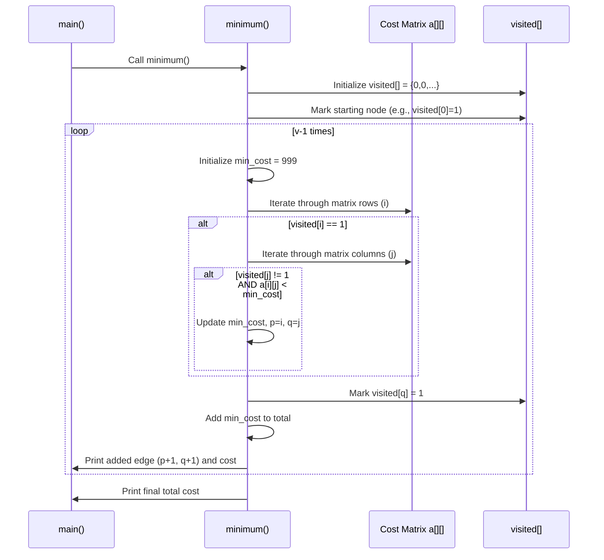

# Chapter 6: Minimum Spanning Tree (MST) Algorithm (Prim's)

Welcome back! In [Chapter 5: Graph Representation](05_graph_representation_.md), we learned how to represent networks like flight paths using adjacency matrices and adjacency lists. Now, we'll use that graph knowledge to solve a very practical problem: connecting everything together with the minimum possible cost.

## What's the Problem? Cheapest Way to Connect Everything!

Imagine you're starting a new phone company in a small region. You have several towns (let's call them branches or **vertices**) that need to be connected with phone lines (let's call these connections **edges**). Laying cables between different pairs of towns has different costs (weights) depending on the distance, terrain, etc.

Your goal is to connect **all** the towns together, directly or indirectly, so that everyone can call everyone else. But you want to do this using the **minimum possible total cable length (cost)**. You don't want to create unnecessary redundant connections (loops) because that just adds extra cost.

How do you figure out *which* specific connections to build to achieve this minimum total cost while ensuring every town is part of the network?

This is the classic **Minimum Spanning Tree (MST)** problem.
*   **Tree:** We want the final set of connections to form a "tree" structure – meaning no loops or cycles. If there's a loop, one of the connections in that loop is redundant for just *connecting* everything.
*   **Spanning:** The tree must "span" or include *all* the original vertices (towns). Everyone needs to be connected.
*   **Minimum:** The sum of the weights (costs) of all the edges (cables) used in the tree should be the smallest possible compared to any other way of connecting all the towns.

The `7_PhoneLines.cpp` file in our DSAL project uses a specific algorithm called **Prim's Algorithm** to solve exactly this problem for a telephone network.

## Prim's Algorithm: The Greedy Approach

Prim's algorithm is a "greedy" algorithm. Think of it like building your phone network step-by-step, always making the cheapest choice *at that moment* that expands your network without creating a loop.

Here’s the basic idea:

1.  **Start Small:** Pick any town (vertex) to start with. This is your initial, tiny connected network.
2.  **Grow Greedily:** Look at all the possible phone lines (edges) that connect a town *already in* your network to a town *not yet* in your network.
3.  **Pick the Cheapest:** Choose the connection with the **lowest cost** (minimum weight) from the options in step 2.
4.  **Add It:** Add this cheapest connection (edge) and the newly reached town (vertex) to your network.
5.  **Repeat:** Keep repeating steps 2-4. Each time, find the absolute cheapest edge connecting a town inside your growing network to a town outside it.
6.  **Stop:** Continue until all towns are included in your network.

The set of connections you added forms the Minimum Spanning Tree! Because you always picked the cheapest available connection to expand, the total cost is minimized.

**Analogy:** Imagine you have several islands (vertices) and potential bridge routes between them, each with a construction cost (weight).
1.  Start on one island.
2.  Find the absolute cheapest bridge you can build from your current connected island(s) to an island you haven't reached yet.
3.  Build that bridge. Now you have more islands connected.
4.  Repeat step 2 and 3 until all islands are connected by some path. The bridges you built form the MST.

```mermaid
graph TD
    subgraph Initial Graph (Potential Connections & Costs)
        A ---|5| B
        A ---|6| C
        A ---|4| D
        B ---|7| C
        C ---|3| D
    end

    subgraph MST Building (Prim's starting at A)
        subgraph Step 1: Start at A
            A1(A)
            style A1 fill:#f9f
        end
        subgraph Step 2: Cheapest edge from {A}? (A-D cost 4)
            A2(A) -- 4 --> D2(D)
            style A2 fill:#f9f
            style D2 fill:#f9f
        end
        subgraph Step 3: Cheapest edge from {A,D}? (D-C cost 3)
             A3(A) -- 4 --> D3(D)
             D3 -- 3 --> C3(C)
             style A3 fill:#f9f
             style D3 fill:#f9f
             style C3 fill:#f9f
        end
         subgraph Step 4: Cheapest edge from {A,D,C}? (A-B cost 5)
             A4(A) -- 4 --> D4(D)
             D4 -- 3 --> C4(C)
             A4 -- 5 --> B4(B)
             style A4 fill:#f9f
             style D4 fill:#f9f
             style C4 fill:#f9f
             style B4 fill:#f9f
        end
        subgraph Final MST (All vertices included)
             A5(A) -- 4 --> D5(D)
             D5 -- 3 --> C5(C)
             A5 -- 5 --> B5(B)
             style A5 fill:#f9f
             style D5 fill:#f9f
             style C5 fill:#f9f
             style B5 fill:#f9f
             subgraph Total Cost
               TC[Total Cost = 4 + 3 + 5 = 12]
             end
        end
    end
```
*In this example, Prim's algorithm found the MST with edges A-D, D-C, and A-B, for a total minimum cost of 12.*

## Using Prim's in `7_PhoneLines.cpp`

This code lets you define the phone network and then uses Prim's algorithm to find the minimum connection cost.

**1. Defining the Network (`input` function):**

First, you tell the program how many towns (branches) there are and what connections exist between them, along with their costs (charges). The program stores this using an **Adjacency Matrix**, similar to what we saw in [Chapter 5: Graph Representation](05_graph_representation_.md). A value of `999` (representing infinity) is used if there's no direct connection.

```c++
// Simplified from 7_PhoneLines.cpp tree::input()
void tree::input() {
    cout << "Enter the no. of branches: "; // e.g., 4 towns
    cin >> v;

    // Initialize matrix: all costs are 999 (infinity) initially
    for (i = 0; i < v; i++) {
        visited[i] = 0; // Mark all towns as not visited yet
        for (j = 0; j < v; j++) {
            a[i][j] = 999; // No connection assumed
        }
    }

    cout << "\nEnter the no. of connections: "; // e.g., 5 possible lines
    cin >> e;

    // Get details for each connection
    for (i = 0; i < e; i++) {
        cout << "Enter end branches (town numbers, e.g., 1 2): " << endl;
        cin >> l >> u; // Read the two towns (e.g., 1 and 2)
        cout << "Enter the charges for this connection: ";
        cin >> w; // Read the cost (e.g., 10)
        // Store cost in matrix (using 0-based index)
        a[l - 1][u - 1] = a[u - 1][l - 1] = w;
    }
}
```
*   This function asks for the number of towns (`v`) and connections (`e`).
*   It initializes a `visited` array (all 0s, meaning no town is in our network yet) and the cost matrix `a` with `999`.
*   It then loops `e` times, asking for the two towns (`l`, `u`) and the cost (`w`) for each possible connection.
*   It stores the cost `w` in the adjacency matrix `a`. Note that `a[l-1][u-1] = a[u-1][l-1] = w` makes the connection cost the same in both directions (an *undirected* graph).

**2. Displaying the Cost Matrix (`display` function):**

This helper function simply prints the adjacency matrix you created.

```c++
// Simplified from 7_PhoneLines.cpp tree::display()
void tree::display() {
    cout << "\nAdjacency matrix (Costs):\n";
    for (i = 0; i < v; i++) {
        for (j = 0; j < v; j++) {
            cout << a[i][j] << "\t"; // Print cost or 999
        }
        cout << endl;
    }
}
```
*   It loops through the `a` matrix and prints the stored costs, showing the connection charges between all pairs of towns.

**3. Finding the MST (`minimum` function):**

This is where Prim's algorithm is implemented.

```c++
// Simplified from 7_PhoneLines.cpp tree::minimum()
void tree::minimum() {
    int p = 0, q = 0, total = 0, min_cost;
    int edge_count = 0;

    // Start: Mark the first town (index 0) as visited
    // NOTE: The original code starts at visited[1]=1, assuming vertex 1.
    // Let's adjust to start consistently from vertex 0 (branch 1).
    visited[0] = 1;

    // We need v-1 edges to connect v vertices in a tree
    while (edge_count < v - 1) {
        min_cost = 999; // Reset minimum cost for this step

        // Find the cheapest edge connecting a visited town to an unvisited town
        for (i = 0; i < v; i++) {
            if (visited[i] == 1) { // If town 'i' is in our network...
                for (j = 0; j < v; j++) {
                    if (visited[j] != 1) { // ...and town 'j' is not...
                        // Check if this connection is cheaper than the current min
                        if (min_cost > a[i][j]) {
                            min_cost = a[i][j]; // Update minimum cost
                            p = i; // Remember starting town of this edge
                            q = j; // Remember ending town of this edge
                        }
                    }
                }
            }
        }
        // Add the chosen edge to our MST
        visited[q] = 1; // Mark the newly added town as visited
        total = total + min_cost; // Add the cost to the total
        cout << "Added connection: " << (p + 1) << " -> " << (q + 1)
             << " cost: " << min_cost << endl;
        edge_count++; // Increment the count of edges added
    }
    cout << "Minimum total cost: " << total << endl;
}
```
*   It initializes `total` cost and `edge_count` to 0.
*   It marks one starting town as `visited` (here, index 0, representing branch 1).
*   The `while` loop runs until `v-1` edges have been added (enough to connect `v` towns).
*   Inside the loop:
    *   It resets `min_cost` to `999`.
    *   The nested `for` loops search for the edge with the minimum cost (`min_cost`) that connects a `visited` town (`i`) to an `unvisited` town (`j`). The indices `p` and `q` store the endpoints of this cheapest edge found so far.
    *   After checking all possibilities, the edge `(p, q)` with cost `min_cost` is the one chosen by Prim's greedy strategy.
    *   The newly reached town `q` is marked as `visited`.
    *   The edge's cost is added to the `total`.
    *   The chosen connection is printed.
    *   `edge_count` is increased.
*   Finally, the minimum total cost is printed.

**Example Interaction:**

```
==========PRIM'S ALGORITHM=================
1.INPUT
2.DISPLAY
3.MINIMUM
Enter your choice :
1
*******INPUT YOUR VALUES*******
Enter the no. of branches: 4
Enter the no. of connections: 5
Enter end branches (town numbers, e.g., 1 2):
1 2
Enter the charges for this connection: 10
Enter end branches (town numbers, e.g., 1 2):
1 3
Enter the charges for this connection: 5
Enter end branches (town numbers, e.g., 1 2):
1 4
Enter the charges for this connection: 8
Enter end branches (town numbers, e.g., 1 2):
2 3
Enter the charges for this connection: 6
Enter end branches (town numbers, e.g., 1 2):
3 4
Enter the charges for this connection: 12

==========PRIM'S ALGORITHM=================
1.INPUT
2.DISPLAY
3.MINIMUM
Enter your choice :
2
*******DISPLAY THE CONTENTS********
Adjacency matrix (Costs):
999     10      5       8
10      999     6       999
5       6       999     12
8       999     12      999

==========PRIM'S ALGORITHM=================
1.INPUT
2.DISPLAY
3.MINIMUM
Enter your choice :
3
*********MINIMUM************
Added connection: 1 -> 3 cost: 5
Added connection: 3 -> 2 cost: 6
Added connection: 1 -> 4 cost: 8
Minimum total cost: 19
```

## Internal Implementation (`minimum` function)

Let's trace how `minimum()` works behind the scenes.

**Walkthrough:**
Using the example input above (4 towns, costs shown in the matrix).
1.  **Initialization:** `total = 0`, `edge_count = 0`. `visited = [0, 0, 0, 0]`. Let's start by marking town 1 (index 0) as visited: `visited = [1, 0, 0, 0]`.
2.  **Iteration 1 (`edge_count`=0):**
    *   Find cheapest edge from visited {1} to unvisited {2, 3, 4}.
    *   Check edges from town 1:
        *   1 -> 2: cost 10
        *   1 -> 3: cost 5 (Current minimum)
        *   1 -> 4: cost 8
    *   Cheapest is 1 -> 3 with cost 5. `min_cost = 5`, `p = 0`, `q = 2`.
    *   Add edge (1, 3). Mark town 3 (index 2) as visited: `visited = [1, 0, 1, 0]`.
    *   `total = 0 + 5 = 5`. `edge_count = 1`. Print "Added connection: 1 -> 3 cost: 5".
3.  **Iteration 2 (`edge_count`=1):**
    *   Find cheapest edge from visited {1, 3} to unvisited {2, 4}.
    *   Check edges from town 1:
        *   1 -> 2: cost 10
        *   1 -> 4: cost 8 (Current minimum)
    *   Check edges from town 3:
        *   3 -> 2: cost 6 (New minimum!)
        *   3 -> 4: cost 12
    *   Cheapest is 3 -> 2 with cost 6. `min_cost = 6`, `p = 2`, `q = 1`.
    *   Add edge (3, 2). Mark town 2 (index 1) as visited: `visited = [1, 1, 1, 0]`.
    *   `total = 5 + 6 = 11`. `edge_count = 2`. Print "Added connection: 3 -> 2 cost: 6".
4.  **Iteration 3 (`edge_count`=2):**
    *   Find cheapest edge from visited {1, 2, 3} to unvisited {4}.
    *   Check edges from town 1:
        *   1 -> 4: cost 8 (Current minimum)
    *   Check edges from town 2:
        *   (No edges to 4)
    *   Check edges from town 3:
        *   3 -> 4: cost 12
    *   Cheapest is 1 -> 4 with cost 8. `min_cost = 8`, `p = 0`, `q = 3`.
    *   Add edge (1, 4). Mark town 4 (index 3) as visited: `visited = [1, 1, 1, 1]`.
    *   `total = 11 + 8 = 19`. `edge_count = 3`. Print "Added connection: 1 -> 4 cost: 8".
5.  **Stop:** `edge_count` (3) is now equal to `v-1` (4-1 = 3). The loop terminates.
6.  **Final Output:** Print "Minimum total cost: 19".

**Sequence Diagram (Simplified `minimum()`):**



This diagram shows the core loop: finding the minimum edge connecting the visited part to the unvisited part, adding it, updating the visited set, and accumulating the cost.

## Conclusion

Fantastic! You've learned about the **Minimum Spanning Tree (MST)** problem and how **Prim's Algorithm** provides an elegant solution.

*   An MST finds the cheapest way to connect all vertices in a graph without creating cycles.
*   Prim's algorithm builds the MST "greedily" by repeatedly adding the cheapest edge that connects a vertex already in the tree to one that isn't.
*   We saw how `7_PhoneLines.cpp` uses an adjacency matrix ([Chapter 5: Graph Representation](05_graph_representation_.md)) to store costs and implements Prim's algorithm using a `visited` array to keep track of the growing tree.

Graphs and algorithms like Prim's are essential for solving network optimization problems in areas like telecommunications, transportation, and circuit design.

Next up, we'll explore a completely different way to store and retrieve data quickly: **Hashing**. Let's move on to [Chapter 7: Hashing Techniques](07_hashing_techniques_.md).

---

Generated by [AI Codebase Knowledge Builder](https://github.com/The-Pocket/Tutorial-Codebase-Knowledge)