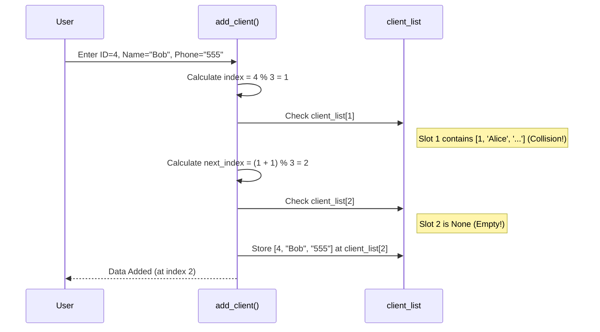

# Chapter 7: Hashing Techniques

Welcome back! In [Chapter 6: Minimum Spanning Tree (MST) Algorithm (Prim's)](06_minimum_spanning_tree__mst__algorithm__prim_s_.md), we learned how to find the cheapest way to connect all points in a network using graphs. Now, we're shifting gears to tackle a different but equally important problem: how to store and find information *really, really fast*.

## What's the Problem? Finding Information Instantly!

Imagine you have a massive telephone directory with millions of names and phone numbers. If you need to find someone's number, searching through the entire book page by page would take forever! Even if it's sorted alphabetically (like a Binary Search Tree from [Chapter 2: Tree Structures (BST, AVL, OBST, GLL)](02_tree_structures__bst__avl__obst__gll__.md)), it still takes some time, especially for very large directories.

What if you could have a "magic" system where you tell it the name, and it *instantly* tells you which page (or even which exact spot) the phone number is on? That's the dream, and **Hashing** is a technique that gets us very close to achieving it.

**Use Case: Super-Fast Telephone Directory**
Our goal is to store pairs of information (like a Client ID and their details, or a Name and Phone Number) in a way that lets us look them up almost instantly using the ID or Name.

## The Big Idea: Hashing = Smart Shelving

Think of a library. Instead of just putting books anywhere, the librarian uses a system. Maybe they assign a code to each subject (like 'SCI' for Science, 'HIS' for History) and put all books with that code on a specific shelf.

Hashing works like that:

1.  **Hash Table:** We start with an empty array (like a set of empty shelves). This array is called a **Hash Table**.
2.  **Hash Function:** We create a "magic function" called a **Hash Function**. This function takes a piece of data you want to store (like a client ID or a person's name) and converts it into a specific index number for the array (the shelf number).
3.  **Storing:** To store an item, you feed its key (e.g., client ID) into the hash function to get an index. You then place the item at that index in the hash table.
4.  **Finding:** To find an item later, you feed its key into the *same* hash function. It gives you the *same* index, telling you exactly where to look in the hash table!

This is incredibly fast because calculating the index using the hash function is usually very quick, and accessing an element in an array by its index is also very quick.

**Example Hash Function:**
A very common, simple hash function is the **modulo operator (`%`)**. If our hash table (array) has `size` slots, the hash function could be:
`index = key % size`
(Where `key` is the numerical value we're hashing, like a client ID).

*   If `size = 10` and `key = 123`, then `index = 123 % 10 = 3`. The item goes into `table[3]`.
*   If `size = 10` and `key = 45`, then `index = 45 % 10 = 5`. The item goes into `table[5]`.

The DSAL C++ code (`ass2_chain_wr.cpp`, `ass2_chain_wor.cpp`) uses `key = num % 10` (effectively `size = 10`). The Python code (`1_Telephone.py`) uses `index = client_id % size`.

```mermaid
graph LR
    subgraph Hashing Process
        InputKey[Input Key (e.g., 123)] --> HashFunc{Hash Function (key % 10)}
        HashFunc --> Index[Calculated Index (3)]
        Index --> HashTable[Hash Table Array]
        HashTable -- Access --> Slot3[Slot 3]
        Slot3 -- Store/Retrieve --> Data[Your Data]
    end
```

## Uh Oh... Collisions! (What if two things map to the same spot?)

The magic system sounds perfect, right? But what happens if our hash function calculates the *same index* for two *different* keys?
*   Using `key % 10`, both `key = 45` and `key = 75` give `index = 5`.
*   Where do we put the second item if `table[5]` is already filled?

This is called a **Collision**. It's like two different library books being assigned to the exact same spot on the same shelf. Collisions are common, especially if the hash table isn't huge. We need strategies to handle them!

The DSAL project demonstrates two common collision resolution strategies:

### Strategy 1: Separate Chaining (Lists at each Spot)

**Idea:** If multiple items hash to the same index `i`, we store a **linked list** of items at that position `table[i]`.

**Library Analogy:** If multiple 'Science' books map to Shelf 7, don't just put one there. Start a *list* or *stack* of 'Science' books right there on Shelf 7. When you look for a specific 'Science' book, you go to Shelf 7 and then search through the short list you find there.

**DSAL Example (`ass2_chain_wor.cpp` - Chaining Without Replacement):**
This code uses a 2D array `a[MAX][2]` to simulate this.
*   `a[i][0]` stores the actual data (the number) that hashed to index `i` OR is part of a chain starting elsewhere.
*   `a[i][1]` acts like the `next` pointer in a linked list. It stores the *index* of the *next* item in the chain for this slot, or `-1` if it's the end of the chain.

**Code Snippet (Simplified Insertion Logic from `ass2_chain_wor.cpp`):**

```c++
#define MAX 10
int a[MAX][2]; // 0=data, 1=next_index (-1 if none)
// (Assume 'a' is initialized with -1s)

// Function to add 'num' which hashes to 'key'
void chain(int key, int num) {
    int i;
    int count = 0; // (Check if table is full - simplified out)

    if (a[key][0] == -1) { // ---- Case 1: Spot 'key' is empty ----
        a[key][0] = num; // Place number directly
    } else { // ---- Case 2: Collision! Spot 'key' is occupied ----
        // Find the end of the chain starting at 'key'
        int current_chain_pos = key;
        while (a[current_chain_pos][1] != -1) {
            current_chain_pos = a[current_chain_pos][1]; // Follow the chain
        }

        // Find the *next available empty slot* anywhere in the table
        // (Simple linear search for empty slot - could be smarter)
        int empty_slot = -1;
        for (i = key + 1; i < MAX; i++) { // Search downwards first
            if (a[i][0] == -1) {
                empty_slot = i; break;
            }
        }
        if (empty_slot == -1) { // If not found below, search upwards
            for (i = 0; i < key; i++) {
                if (a[i][0] == -1) {
                    empty_slot = i; break;
                }
            }
        }
        // (Handle table full error if empty_slot is still -1)

        // Place the new number in the found empty slot
        a[empty_slot][0] = num;
        // Link the previous end of the chain to this new node
        a[current_chain_pos][1] = empty_slot;
    }
}
```
*   **Line 2:** Defines the table `a` (size 10). `a[i][0]` holds the stored number, `a[i][1]` holds the index of the next element in the chain (-1 for end).
*   **Line 7:** If the calculated `key` slot is empty (`-1`), just place the `num` there. Easy!
*   **Line 9 (Collision):** If `a[key][0]` is *not* empty, there's a collision.
*   **Lines 11-14:** Follow the chain pointers (`a[...][1]`) starting from `key` to find the last node currently associated with this `key`.
*   **Lines 17-28:** Search the *entire* hash table (downwards from `key`, then upwards) to find *any* empty slot (`a[i][0] == -1`). This is where the new number will physically live.
*   **Line 31:** Put the new number `num` into the found `empty_slot`.
*   **Line 33:** Update the `next` pointer (`a[...][1]`) of the *previous end of the chain* to point to this `empty_slot`, effectively adding the new number to the list for `key`.

**Example Input/Output (Chaining):**
Hash function: `key % 10`. Table size: 10.
1.  Insert `25`: `25 % 10 = 5`. `a[5][0] = 25`, `a[5][1] = -1`.
2.  Insert `35`: `35 % 10 = 5`. Collision! Spot 5 is full.
    *   Find an empty slot, say `a[6][0]` is empty.
    *   Place 35 there: `a[6][0] = 35`, `a[6][1] = -1`.
    *   Link the item at index 5 to index 6: `a[5][1] = 6`.
3.  Insert `15`: `15 % 10 = 5`. Collision! Spot 5 is full.
    *   Follow chain from 5: `a[5][1]` points to 6.
    *   Find empty slot, say `a[7][0]` is empty.
    *   Place 15 there: `a[7][0] = 15`, `a[7][1] = -1`.
    *   Link the previous end of the chain (index 6) to index 7: `a[6][1] = 7`.

**Resulting Table (Conceptual):**
Index | Data | Next Index
----- | ---- | ----------
...   | ...  | ...
5     | 25   | 6
6     | 35   | 7
7     | 15   | -1
...   | ...  | ...

When searching for 15: Hash `15 % 10 = 5`. Go to index 5. Is it 15? No (it's 25). Follow `next` pointer (6). Go to index 6. Is it 15? No (it's 35). Follow `next` pointer (7). Go to index 7. Is it 15? Yes! Found it.

### Strategy 2: Linear Probing (Check Next Spot)

**Idea:** If the calculated index `i` is full, just try the *next* slot `i+1`. If `i+1` is full, try `i+2`, and so on, wrapping around to the beginning of the table if you reach the end. Stop when you find an empty slot.

**Library Analogy:** If Shelf 7 is full when you try to put a book there, just try Shelf 8. If Shelf 8 is full, try Shelf 9. If you reach the last shelf and it's full, wrap around and try Shelf 0, then Shelf 1, etc., until you find *any* empty shelf.

**DSAL Example (`1_Telephone.py`):**
This Python code implements hashing with linear probing for a telephone directory.

**Code Snippet (`1_Telephone.py` - Add Client):**

```python
# Assume size = 3 and client_list = [None] * size

def add_client():
    client_id = int(input("client id: ")) # e.g., 4
    name = input("client name: ") # e.g., Bob
    telephone = input("client telephone: ") # e.g., 555-1234
    client_details = [client_id, name, telephone]

    index = client_id % size # Calculate initial index (4 % 3 = 1)

    # Linear Probing loop
    for i in range(size): # Try at most 'size' times
        # Check the calculated slot (current 'index')
        if client_list[index] == None:
            # Found an empty spot! Store data here.
            client_list[index] = client_details
            print(f"Adding data at index {index}: {client_details}")
            break # Exit the loop, insertion done
        else:
            # Collision! Slot is occupied. Try the next spot.
            index = (index + 1) % size # Move to next index, wrap around if needed
    else:
        # This 'else' belongs to the 'for' loop
        # If the loop completes without 'break', the table is full
        print("Hash table is full!")
```
*   **Line 7:** Calculates the initial hash index using modulo.
*   **Line 10:** The loop tries up to `size` possible slots.
*   **Line 12:** Checks if the current `index` is empty (`None`).
*   **Lines 14-16:** If empty, place the `client_details` there and `break` out of the loop.
*   **Lines 17-19 (Collision):** If the spot is *not* empty, calculate the *next* index using `(index + 1) % size`. The `% size` handles wrapping around from the end back to the beginning of the array. The loop then continues to check this *new* index.
*   **Lines 20-23:** If the loop finishes without finding an empty spot (it tried all `size` slots), it means the table is full.

**Example Input/Output (Linear Probing):**
`size = 3`. `client_list = [None, None, None]`.
1.  Insert ID `1`: `1 % 3 = 1`. `client_list[1]` is empty. Store at index 1.
    `client_list = [None, [1, 'Alice', '...'], None]`
2.  Insert ID `4`: `4 % 3 = 1`. `client_list[1]` is full (Alice).
    *   Try next index: `(1 + 1) % 3 = 2`.
    *   `client_list[2]` is empty. Store at index 2.
    `client_list = [None, [1, 'Alice', '...'], [4, 'Bob', '...']]`
3.  Insert ID `7`: `7 % 3 = 1`. `client_list[1]` is full (Alice).
    *   Try next index: `(1 + 1) % 3 = 2`.
    *   `client_list[2]` is full (Bob).
    *   Try next index: `(2 + 1) % 3 = 0`.
    *   `client_list[0]` is empty. Store at index 0.
    `client_list = [[7, 'Charlie', '...'], [1, 'Alice', '...'], [4, 'Bob', '...']]`

Searching works similarly: calculate the initial index, check if the item is there. If not, and the slot isn't empty, probe linearly (`(index + 1) % size`) until you find the item or an empty slot (which means the item isn't in the table).

## Internal Implementation (Linear Probing Add)

Let's trace the `add_client` function from `1_Telephone.py` when adding ID `4` after ID `1` is already present (`size = 3`).

**Walkthrough:**
1.  **User Call:** `add_client()` is called. User enters ID=4, Name="Bob", Phone="555". `client_details = [4, 'Bob', '555']`.
2.  **Hash Calculation:** `index = 4 % 3 = 1`.
3.  **Loop Starts (i=0):**
    *   Check `client_list[1]`. Let's assume it contains `[1, 'Alice', '...']` (not `None`). Collision!
    *   Calculate next index: `index = (1 + 1) % 3 = 2`.
4.  **Loop Continues (i=1):**
    *   Check `client_list[2]`. Let's assume it's `None`. Empty spot found!
    *   Store data: `client_list[2] = [4, 'Bob', '555']`.
    *   `print(...)`.
    *   `break` the loop.
5.  **Function Ends:** Insertion complete.

**Sequence Diagram (Simplified `add_client` with collision):**



This shows how linear probing handles the collision by simply checking the next available slot.

## Conclusion

You've learned about **Hashing**, a powerful technique for storing and retrieving data very quickly!

*   It uses a **Hash Function** to map keys (like IDs or names) to indices in an array called a **Hash Table**.
*   The main challenge is **Collisions**, where different keys map to the same index.
*   We explored two ways to handle collisions shown in DSAL:
    *   **Separate Chaining:** Store items that collide in a linked list at that index (like `ass2_chain_wor.cpp`).
    *   **Linear Probing:** If a spot is full, search for the next empty spot sequentially in the array (like `1_Telephone.py`).
*   Hashing is fundamental to many efficient data structures like hash maps (dictionaries in Python, `std::unordered_map` in C++) used for fast lookups.

While hashing gives us near-instant access, sometimes we need to process data stored in files sequentially, one record after another. Our final chapter will explore techniques for managing data in sequential files. Let's move on to [Chapter 8: Sequential File Management](08_sequential_file_management_.md).

---

Generated by [AI Codebase Knowledge Builder](https://github.com/The-Pocket/Tutorial-Codebase-Knowledge)