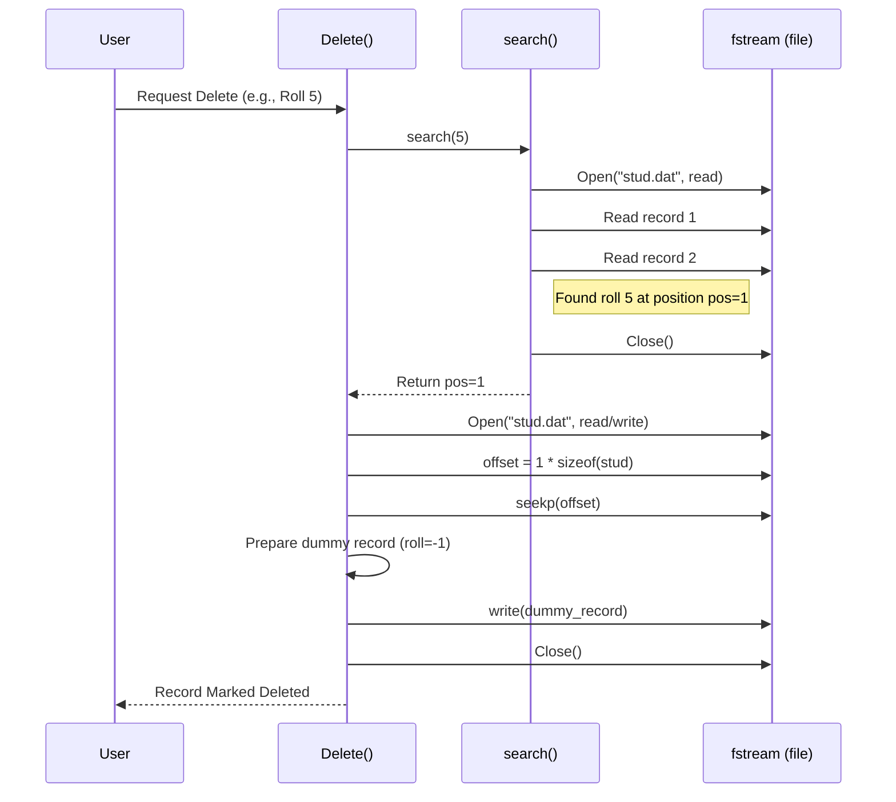

# Chapter 8: Sequential File Management

Hey there! Welcome to the final chapter of our DSAL journey. In [Chapter 7: Hashing Techniques](07_hashing_techniques_.md), we saw how hashing helps us find information super quickly, almost instantly, by calculating an item's storage location. Now, we'll explore a different, more traditional way of handling data, especially when dealing with larger amounts that need to be stored permanently: **Sequential File Management**.

## What's the Problem? Storing Data That Lasts

Imagine you're building a simple system for your school office to keep track of student records. You need to store details like Roll Number, Name, Division, and Address for many students. When you run your program, you can work with this data in memory. But what happens when you close the program? All that information stored in variables disappears!

We need a way to save the data so it **persists** (lasts) even after the program stops running, just like putting paper records into a physical file cabinet. We also need basic ways to manage these records: add new students (**Create**), view existing records (**Read**), change a student's address (**Update**), and remove students who have left (**Delete**). These are often called **CRUD** operations.

**Use Case: A Simple Student Record System**
Our goal is to create a program that can manage student records (Roll No, Name, Division, Address) stored in an external file. The program should allow users to perform basic CRUD operations.

## Files: Your Digital Filing Cabinet

Sequential file management is like keeping those paper records in a file cabinet, one folder placed right after the other. In the digital world, our "cabinet" is a **file** on the computer's hard drive or SSD.

**Key Ideas:**

1.  **Persistence:** Data stored in a file stays there even when your program isn't running. You can close the program, turn off the computer, and the file (and the data inside it) will still be there when you come back.
2.  **Structured Data:** We often store **records**, where each record represents one entity (like a student) and contains multiple pieces of information (**fields**). In C++, we use `struct` to define the blueprint for these records.

    ```c++
    // Blueprint for a student record (from 11_DepttStudent.cpp)
    struct stud {
        int roll;       // Field 1: Roll Number
        char name[10];  // Field 2: Name (up to 9 chars + null)
        char div;       // Field 3: Division (single character)
        char add[10];   // Field 4: Address (up to 9 chars + null)
    };
    stud rec; // A variable to hold one student record
    ```
    *   This `struct stud` defines the structure for each student's record. `rec` is a variable that can hold the data for one student at a time.

3.  **Sequential Access:** The simplest way to work with files is sequentially. When you write data, new records are typically added one after the other at the end of the file. When you read data, you usually start from the beginning and read one record after another, in the order they were stored. Think of reading a book from page 1 onwards, or listening to a music tape from the beginning.
4.  **File Streams (C++):** C++ uses objects called "streams" to interact with files. We'll mainly see:
    *   `ofstream`: Output File Stream – Used for **writing** data *to* a file.
    *   `ifstream`: Input File Stream – Used for **reading** data *from* a file.
    *   `fstream`: File Stream – Can be used for both reading and writing.
    *   `ios::binary`: We often open files in "binary mode". This means the program writes the raw bytes of our `struct` directly to the file, without trying to format it as human-readable text. This is efficient for storing structured data.

## Managing Student Records (CRUD in `11_DepttStudent.cpp`)

Let's see how the `11_DepttStudent.cpp` code implements the CRUD operations for our student records.

### 1. Create: Adding New Student Records

The `create()` function allows the user to enter details for one or more students and writes these records sequentially to the file "stud.dat".

```c++
// Simplified from 11_DepttStudent.cpp student::create()
void student::create() {
    char ans;
    ofstream fout; // Create an output file stream object
    // Open file "stud.dat" for output (writing) in binary mode
    fout.open("stud.dat", ios::out | ios::binary);

    do {
        cout << "\n\tEnter Roll No: "; cin >> rec.roll;
        cout << "\tEnter Name: "; cin >> rec.name;
        cout << "\tEnter Division: "; cin >> rec.div;
        cout << "\tEnter Address: "; cin >> rec.add;

        // Write the raw bytes of the 'rec' struct to the file
        fout.write((char *)&rec, sizeof(stud));

        cout << "\n\tAdd More Records? (y/n): "; cin >> ans;
    } while (ans == 'y' || ans == 'Y');

    fout.close(); // Close the file when done
}
```
*   An `ofstream` object `fout` is created and used to open `stud.dat`. `ios::out` means open for writing (this will overwrite the file if it exists).
*   Inside the loop, the program gets student details from the user and stores them in the `rec` variable.
*   `fout.write((char *)&rec, sizeof(stud));` is the crucial part: it takes the memory representation of the `rec` struct and writes exactly `sizeof(stud)` bytes to the file.
*   Each new record is written immediately after the previous one.
*   The file is closed using `fout.close()`.

**Example Interaction:**
If you add two students (Roll 1, Alice and Roll 2, Bob), the file "stud.dat" will contain the raw byte data for Alice's record followed immediately by the raw byte data for Bob's record.

### 2. Read (Display): Viewing All Records

The `display()` function reads the file from the beginning, record by record, and prints the details to the console.

```c++
// Simplified from 11_DepttStudent.cpp student::display()
void student::display() {
    ifstream fin; // Create an input file stream object
    // Open file "stud.dat" for input (reading) in binary mode
    fin.open("stud.dat", ios::in | ios::binary);
    fin.seekg(0, ios::beg); // Ensure we start reading from the beginning

    cout << "\n\t--- Student Records ---";
    cout << "\n\tRoll\tName\tDiv\tAddress";

    // Read records one by one until the end of the file
    while (fin.read((char *)&rec, sizeof(stud))) {
        // Check if the record is marked as deleted (-1)
        if (rec.roll != -1) {
            cout << "\n\t" << rec.roll << "\t" << rec.name
                 << "\t" << rec.div << "\t" << rec.add;
        }
    }
    fin.close(); // Close the file
}
```
*   An `ifstream` object `fin` is used to open the file for reading (`ios::in`).
*   `fin.seekg(0, ios::beg);` explicitly sets the reading position to the beginning (byte 0) of the file.
*   The `while(fin.read(...))` loop attempts to read `sizeof(stud)` bytes from the file into the `rec` variable. This loop continues as long as reads are successful (i.e., we haven't reached the end of the file).
*   Inside the loop, it checks if `rec.roll` is `-1` (our marker for a deleted record) before printing.

**Example Output:**
If the file contains records for Alice (1) and Bob (2), the output would look like:
```
        --- Student Records ---
        Roll    Name    Div     Address
        1       Alice   A       Addr1
        2       Bob     B       Addr2
```

### 3. Search: Finding a Specific Record

The `search()` function reads sequentially through the file to find a student with a specific roll number.

```c++
// Simplified from 11_DepttStudent.cpp student::search()
int student::search() {
    int r, i = 0; // 'i' will track the record position (0, 1, 2...)
    ifstream fin;
    fin.open("stud.dat", ios::in | ios::binary);
    fin.seekg(0, ios::beg);

    cout << "\n\tEnter Roll No to Search: "; cin >> r;

    while (fin.read((char *)&rec, sizeof(stud))) {
        if (rec.roll == r) { // Found a match?
            cout << "\n\tRecord Found!\n";
            cout << "\tRoll\tName\tDiv\tAddress";
            cout << "\n\t" << rec.roll << "\t" << rec.name
                 << "\t" << rec.div << "\t" << rec.add;
            fin.close();
            return i; // Return the position (index) of the record
        }
        i++; // Move to the next record position
    }
    fin.close();
    cout << "\n\tRecord Not Found.\n";
    return -1; // Return -1 if not found (original returned 0)
}
```
*   It asks the user for the `roll` number (`r`) to search for.
*   It reads records sequentially, just like `display()`.
*   Inside the loop, it compares `rec.roll` with the target `r`.
*   If a match is found, it prints the record details and returns the position `i` (0 for the first record, 1 for the second, etc.).
*   If the loop finishes without finding the roll number, it returns an indicator (-1 here) that the record wasn't found.

### 4. Delete: Removing a Record (Logically)

The `Delete()` function in `11_DepttStudent.cpp` performs a **logical delete**. It doesn't actually remove the record from the file. Instead, it finds the record and *marks* it as deleted by overwriting its `roll` number field with `-1`.

```c++
// Simplified from 11_DepttStudent.cpp student::Delete()
void student::Delete() {
    int pos = search(); // First, find the position of the record to delete

    if (pos == -1) { // Check if search returned "not found"
        // cout << "\n\tRecord Not Found (already printed by search)";
        return;
    }

    fstream file; // Use fstream for both reading AND writing
    file.open("stud.dat", ios::in | ios::out | ios::binary);

    // Calculate the exact byte offset to start writing
    int offset = pos * sizeof(stud);
    // Move the file's write pointer to that offset
    file.seekp(offset);

    // Prepare a 'dummy' record to overwrite the old one
    rec.roll = -1;
    strcpy(rec.name, "DEL"); // Copy "DEL" into name field
    rec.div = 'X';
    strcpy(rec.add, "DEL");

    // Write the dummy record over the existing record's bytes
    file.write((char *)&rec, sizeof(stud));

    file.close();
    cout << "\n\tRecord Marked as Deleted.\n";
}
```
*   It first calls `search()` to find the *position* (`pos`) of the record to be deleted.
*   It opens the file using `fstream` in both input (`in`) and output (`out`) modes.
*   **`seekp(offset)`:** This is key! `seekp` (seek put/position) moves the file's *write* pointer directly to a specific byte location. `offset` is calculated as `pos * sizeof(stud)`, which tells the program exactly where the target record starts in the file.
*   It then sets the `rec` variable's fields to placeholder values (most importantly `rec.roll = -1`).
*   `file.write()` then overwrites the data at the calculated `offset` with the contents of the modified `rec`.
*   The `display()` function knows to skip records where `roll == -1`.

**Physical Deletion (Alternative in `12_Company.cpp`):**
The `12_Company.cpp` code demonstrates **physical deletion**. This involves:
1. Opening the original file for reading.
2. Opening a *new temporary file* for writing.
3. Reading records one by one from the original file.
4. If the record is *not* the one to be deleted, write it to the temporary file.
5. If it *is* the one to delete, simply *skip* writing it to the temporary file.
6. After processing all records, close both files.
7. Delete the original file.
8. Rename the temporary file to the original file's name.
This physically removes the record but is generally slower as it involves rewriting the entire file.

### 5. Update: Modifying a Record

Updating a record typically involves:
1. Searching for the record to find its position (`pos`).
2. Using `seekp()` to move the file pointer to the start of that record (`pos * sizeof(struct)`).
3. Reading the *new* data from the user into the `rec` variable.
4. Using `write()` to overwrite the old record data at that position with the new data.

The `12_Company.cpp` code implements this pattern in its `case '5'` (Update) section. `11_DepttStudent.cpp` doesn't have a dedicated update function, but the logic is the same as the `Delete` function, except you'd fill `rec` with new valid data instead of deletion markers before writing.

## Internal Implementation: Bytes and Pointers

How does the computer actually read and write these `struct`s?

*   **`write((char *)&rec, sizeof(stud))`:**
    *   `&rec`: Gets the memory address where the `rec` struct starts.
    *   `(char *)`: Casts this address to a "pointer to a character (byte)". This treats the struct's memory area as just a sequence of raw bytes.
    *   `sizeof(stud)`: Calculates how many bytes the `stud` struct occupies in memory.
    *   `fout.write(...)`: Copies exactly that many bytes from the memory location of `rec` directly into the file at the current write position.

*   **`read((char *)&rec, sizeof(stud))`:**
    *   Works the opposite way. It reads `sizeof(stud)` bytes *from* the file at the current read position.
    *   It copies these bytes directly into the memory location occupied by the `rec` variable, effectively reconstructing the `struct` data.

*   **File Pointers (`seekg`, `seekp`):**
    *   The operating system maintains internal "pointers" (not C++ pointers, but position indicators) for each open file, tracking where the next `read` (`seekg` - seek get/get position) or `write` (`seekp`) operation will occur.
    *   Reading/writing `sizeof(stud)` bytes automatically advances the corresponding pointer by that amount, making sequential access easy.
    *   `seekg(offset, ios::beg)` and `seekp(offset, ios::beg)` allow you to *jump* the read or write pointer directly to a specific byte `offset` from the beginning (`ios::beg`) of the file. This enables random access needed for Update and logical Delete.

**Sequence Diagram (Simplified Logical Delete):**


This shows the flow: Search finds the position, Seek moves the pointer, Write overwrites the data.

## Conclusion

Congratulations on reaching the end of the DSAL tutorial series! In this chapter, you learned about **Sequential File Management**:

*   It allows data (like student records stored in `struct`s) to **persist** in external files.
*   Files are often accessed **sequentially**, reading or writing records one after another.
*   Basic **CRUD** operations (Create, Read, Update, Delete) are essential for managing file data.
*   C++ uses **file streams** (`ofstream`, `ifstream`, `fstream`) and binary `read`/`write` operations to interact with files.
*   **Logical deletion** marks records as invalid, while **physical deletion** rewrites the file without the deleted record.
*   Functions like `seekp` and `seekg` allow jumping to specific byte locations, enabling updates and logical deletes without rewriting the whole file.

Understanding file management is crucial for building applications that handle persistent data, forming a bridge between data structures in memory and long-term storage.

We hope this series has given you a solid foundation in understanding and implementing fundamental data structures and algorithms. Keep exploring, keep coding!

---

Generated by [AI Codebase Knowledge Builder](https://github.com/The-Pocket/Tutorial-Codebase-Knowledge)