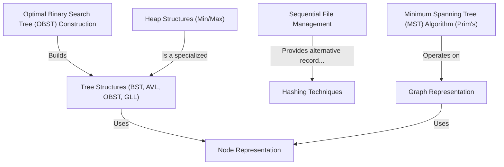

# Tutorial: DSAL

This project explores fundamental **Data Structures and Algorithms (DSAL)** using C++ and Python examples.
It demonstrates how to organize information with various *Tree Structures* (like BST, AVL, OBST, GLL for books), perform fast lookups using **Hashing Techniques**, and represent networks using **Graphs**.
The code also includes algorithms like finding the cheapest way to connect points (**Minimum Spanning Tree**) and building optimized search trees (**OBST Construction**).
Furthermore, it covers **Heap Structures** for managing priorities and basic **Sequential File Management** for storing data persistently, often using a fundamental **Node Representation** as a building block.

**Source Repository:** [https://github.com/Soham-1905/DSAL.git](https://github.com/Soham-1905/DSAL.git)

## Chapters

1. [Node Representation
](01_node_representation_.md)
2. [Tree Structures (BST, AVL, OBST, GLL)
](02_tree_structures__bst__avl__obst__gll__.md)
3. [Heap Structures (Min/Max)
](03_heap_structures__min_max__.md)
4. [Optimal Binary Search Tree (OBST) Construction
](04_optimal_binary_search_tree__obst__construction_.md)
5. [Graph Representation
](05_graph_representation_.md)
6. [Minimum Spanning Tree (MST) Algorithm (Prim's)
](06_minimum_spanning_tree__mst__algorithm__prim_s__.md)
7. [Hashing Techniques
](07_hashing_techniques_.md)
8. [Sequential File Management
](08_sequential_file_management_.md)

---

Generated by [AI Codebase Knowledge Builder](https://github.com/The-Pocket/Tutorial-Codebase-Knowledge)